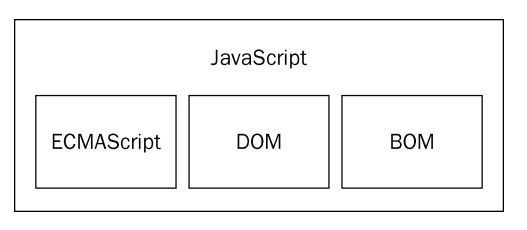

title: Javascrpt 高级程序设计_01_JavaScript 简介
author: ProSayJ
tags:
  - JavaScript
categories:
  - 前端
date: 2019-03-07 09:13:00
---
F:\desk\书\书\Web\Javascrpt  高级程序设计（第3版）英文.pdf

[JavaScript 完全手册](https://www.html.cn/archives/9922)

http://www.runoob.com/w3cnote/free-html5-css3-loaders-preloaders.html
# JavaScript 简史
- javaScript 诞生于 1995 年。主要作用是：负责的一些输入验证操作。
- 随着 Web 平台需求的不断增长，JavaScript 也开始不断的发展，以满足世界上最广泛使用的生态系统之一的需求。如今已经发展成为一门强大的编程语言。
- 

# JavaScript 实现
## JavaScript 的组成：
- 核心（ECMAScript）
- 文档对象模型（DOM）
- 浏览器对象模型（BOM）

### ECMAScript
- 由 ECMA-262 定义。
- ECMAScript 与 Web 浏览器没有依赖关系。
- 我们常见的 Web 浏览器只是 ECMAScript 实现可能的**宿主环境之一**。

#### ECMA-262规定了这门语言的下列组成部分：
- 语法
- 类型
- 语句
- 关键字
- 保留字
- 操作符
- 对象

**JavaScript 实现了 ECMAScript，Adobe ActionScript 同样也实现了 ECMAScript**

### 文档对象模型（DOM）
文档对象模型（DOM， Document Object Model）是针对 XML 但经过扩展用于 HTML 的应用程序编程接口(API， Application Programming Interface)。 
DOM 把整个页面映射为一个多层节点结构。 HTML 或 XML 页面中的每个组成部分都是某种类型的节点，这些节点又包含着不同类型的数据。

借助 DOM 提供的 API，开发人员可以轻松自如地删除、添加、替换或修改任何节点。
#### 为什么要使用 DOM
由于 Netscape 和微软在开发 DHTML (Dynamic HTML)方面各持己见，对开发人员而言，如果想继续保持 Web 跨平台的天性，就必须额外多做一些工作。而人们真正担心的是，如果不对 Netscape 和微软加以控制， Web 开发领域就会出现技术上两强割据，浏览器互不兼容的局面。此时，负责制定 Web 通信标准的 W3C（World Wide Web Consortium，万维网联盟）开始着手规划 DOM。

