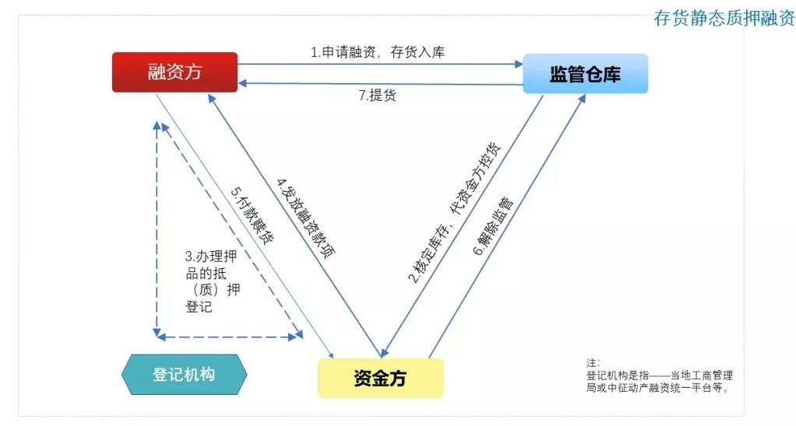

title: 图解10种常见供应链金融产品
author: ProSayJ
tags:
  - 供应链金融
categories:
  - 工作相关
date: 2019-03-04 15:16:00
---
[图解10种常见供应链金融产品](https://mp.weixin.qq.com/s/L2O5Xfjh41sbBwPmX5Q52g)

# 1.“应收类”产品

## 1.1 保理

是指资金方（银行或商业保理公司等）与融资方签署保理合同，融资方将其在国内采用赊销方式完成商品销售或提供服务所形成的应收账款转让给资金方，并由资金方为其提供融资、应收账款管理，账款催收和坏账担保等综合性金融服务。
保理产品种类繁多，详见 链接文章①:[《国内保理业务分类》](./国内保理业务分类.md)。当然，保理业务的细分种类远不止于此，厚朴保理的李书文（总）有专著《商业保理理论与实务》，有兴趣的朋友可以阅读。
本文选择以下两种保理业务进行说明：

### 国内保理业务分类

#### 分类标准1-是否通知采购方转让事宜

##### 明保理   
应收债权转让一经发生，销售方（卖方/债权人）立即以书面形式将债权转让事实通知采购方，指示采购方将应付款项直接给付资金方，或由资金方委托销售方作为收账代理人继续向采购方收款，采购方将有关款项付至销售方开立在资金方指定的银行账户，资金方由此账户扣收。

##### 暗保理   
债权转让一经发生，销售方（卖方/债权人）在转让之时并不立即通知采购方，资金方仅委托销售方作为收账代理人继续向采购方收款，采购方将有关款项付至销售方开立在资金方指定账户。

  

#### 分类标准2-是否保留对销售方的追索权  

##### 有追索权（回购型）   
根据销售方（卖方/债权人）申请，资金方受让其与采购方因交易产生的债权，采购方不论何种原因到期不付款时，资金方均有权向销售方追索，或按照保理合同约定，销售方有义务按照约定金额自资金方回购应收债权，应收债权的坏账风险由转让应收债权的销售方承担。

##### 无追索权（卖断型）   
销售方（卖方/债权人）将其应收债权转让给资金方，在其所转让的应收债权因采购方信用问题而到期无法收回时，资金方不能够向销售方进行追偿，所转让的应收债权的坏账风险由资金方承担。

 

#### 分类标准3-业务发起人

##### 正向保理   
从上游供应商切入供应链，开展保理业务，为保理业务常见的展业方式。

##### 反向保理   
是一种较为特殊的保理业务“拓展方式”，由债务人作为保理业务的申请人或发起人申请叙做保理业务，即通过采购方（核心企业）展业，批量营销供应商。

> **[info] 备注**
> 卖断型保理中的采购方信用问题是指除下列以外情形：商务纠纷、欺诈、不可抗力或司法裁定或仲裁的原因，导致采购方到期不付款。

其中，商务纠纷是指销售方（卖方/债权人）违反商务合同的义务，及/或买卖双方因商务合同产生的争议（包括但不限于交易商品的品质、交货方式及期限、价格、数量、付款方式及期限、争议解决方式等情况而产生的争议），及/或采购方与销售方达成债务免除、折让、和解、抵消合同的情形。

### 1.1.1:有追索权明保理

**简明释义:**
> 保理业务的一种。“有追索权”是指:无论应收账款因何原因不能收回，保理商都有权向融资方索回已付融资款项；“明保理”是指，应收账款的转让通知卖方并经其确认。

**适用行业:**
> 包括但不限于以下行业：电信、租赁、医疗、航空、铁路交通、电子设备制造等。

**综合项:**
- 参 与 方：融资方，融资方债务人，资金方。
- 融资用途：不限。
- 担保方式：信用。

**融资背景:**
- 融资方与其下游的交易、结算关系稳定，但下游企业相对强势，导致融资方回款周期长，资金周转压力大；
- 融资方需优化财报。

**产品功能/ 解决的问题:**
- 将未到期的应收账款立即转换为销售收入，增加资产流动性，改善财务报表。
- 对采购方提供更有竞争力的远期付款条件，有利于拓展市场、增加销售。
- 采购方的信用风险转由受让应收账款的资金方承担，保障自身回款。
- 资信调查、账务管理和账款追收等由受让应收账款的资金方负责，节约管理成本。

### 1.1.2 租赁保理

**简明释义:**
> 保理业务的一种。资金方基于“租赁公司”的应收租金而为其提供的保理融资业务，类似于为保理商提供的“再保理”服务。

**适用行业:**
> 租赁公司常见的展业范围。

**综合项:**
- 参 与 方：融资方（租赁公司），承租人，资金方。
- 融资用途：不限。
- 担保方式：信用。

## 1.2 应收账款质押融资

有关应收账款的相关内容，请见 链接文章② ：[《应收账款的概念和类型》](./应收账款的概念和类型.md)。

### 应收账款的概念和类型
《中华人民共和国物权法》规定应收账款可以作为出质权利。应收账款是指权利人因提供一定的货物、服务或者设施而获得的要求义务人付款的权利，包括现有的和未来的金钱债权及其产生的收益，但不包括因票据或者其他有价证券而产生的付款请求权。可以出质的应收账款包括以下权利：

- （一）销售产生的债权，包括销售货物，供应水、电、气、暖，知识产权的许可使用等；
- （二）出租产生的债权，包括出租动产或不动产；
- （三）提供服务产生的债权；
- （四）公路、桥梁、隧道、渡口等不动产收费权；
- （五）资金方认可的其他形式的权益。

**简明释义:**
应收账款权利人将其因交易而产生的应收账款质押（而非“转让”）予资金方申请的融资。

**适用行业:**
包括但不限于以下行业：电信、租赁、医疗、航空、铁路交通、电子设备制造等（同“保理”适用行业）。

**综合项:**
参 与 方：融资方，融资方债务人，资金方。
融资用途：不限。
担保方式：质押。
链接文章③：[《收账款质押融资业务和保理业务的区别》](./应收账款质押融资业务和保理业务的区别.md)
/////
### 应收账款质押融资业务和保理业务的区别

#### 含义和范畴
- 应收账款质押融资：“应收账款质押”是一种担保方式，具体的融资方式包括：贷款、开立银承、保函等。
- 保理业务：是一种融资方式；一般认为应收账款的转让即“保理”。

#### 生效条件
- 应收账款质押融资：依据《物权法》第228条——“以应收账款出质的”，质权自资金方办理质押登记时设立。
- 保理业务：债权人转让权利的，应通知债务人，若未经通知，则该转让对债务人不发生效力。

#### 法律关系
- 应收账款质押融资：质押是从属法律关系，成立的前提是其担保的债务仍存在；即使资金方不选择执行质押，仍然有权向借款人主张关于主债务的权利。
- 保理业务：资金方通过直接收取应收账款的方式收回支付的交易对价；资金方拥有获得所购应收账款项下报酬的权利。

#### 对质权人和受让人的法律效力
- 应收账款质押融资：
质权人权利——（1）优先受偿权；（2）向出质人和债务人主张质权；（3）对设质应收账款代位物的追及权；（4）对出质应收账款债权的担保利益的追及权；（5）在出质人破产时，对已设立质押的应收账款可主张不将该财产权利列入破产财产范围。
- 保理业务：
对受让人产生的法律效力——（1）债权人发生变更，原债权人退出债权关系；（2）原债权主从权利转移到受让人；（3）转让人对其转让的应收账款债权负瑕疵担保责任。

#### 运行机制
- 应收账款质押融资：质权人行使质权，若所收账款大于被担保的债权金额，须将余额退还出质人；反之，如有不足，可继续向债务人请求偿还不足部分。
- 保理业务：受让人能否向应收账款的债务人收回账款以及收回多少，均与原债权人（转让人）无关；除非发生约定的保理中的商务纠纷及争议。

#### 对应收账款的权利
- 应收账款质押融资：质权人不能通过执行质押而享有质押应收款的任何权益；除非债务人违约。
- 保理业务：受让人有权立即直接获得所购应收账款项下的任何权益；除非出让人回购应收账款债权。

#### 适用应收款的范围
- 应收账款质押融资：（1）销售产生的债权；（2）出租产生的债权；（3）提供服务产生的债权；（4）公路、桥梁、隧道、渡口等不动产收费权；（5）提供贷款或其他信用产生的债权。
- 保理业务：仅限于销售货物或提供服务产生的应收账款（即应收账款质押融资适用范围中“1）”的一部分及“3）”）。

#### 是否应通知债务人
- 应收账款质押融资：要求通知债务人，并取得债务人对应收账款质押的确认。
- 保理业务：可不通知债务人，比如暗保理或商业发票贴现等。但也并非绝对不通知。

#### 对资负率的影响
- 应收账款质押融资：出质人获得融资计入负债科目，增大其资产负债率。
- 保理业务：列入其流动资产科目，对资产负债率无影响；实质上降低了资负率，改善了财务结构。

#### 是否可以合理避税
- 应收账款质押融资：否。
- 保理业务：融资方可通过转让应收账款，将转让的损失部分申报扣除应税所得。

#### 应收账款融资种类
- 应收账款质押融资：资金方的应收款质押融资种类包括表内和表外业务。
- 保理业务：仅限于保理预付款等表内业务。

#### 审批政策
- 应收账款质押融资：参照一般风险业务流程及权限管理。
- 保理业务：有追索权保理业务和无追索权保理业务分别占用销售方和采购方的授信额度。

#### 融资金额
- 应收账款质押融资：若应收账款作为主要担保方式的，应收账款质押率通常不能超过80%。
- 保理业务：考量交易双方资信状况、应收账款质量等因素，质押率不超过发票实有金额的100％。

# 2.“预付类”产品

## 2.1 先票（款）后货

**简明释义**
全称为“先（票）款后货存货质押融资”，顾名思义。
该产品操作过程的前一半属于预付款融资范畴，后一半属动产质押融资。

**适用行业**
包括但不限于以下行业：钢铁、石化、汽车、机械设备等行业；或其他核心企业（卖方）比较强势，要求经销商采用预付货款形式支付采购款的行业。

**综合项**
参 与 方：融资方（经销商），制造商（核心企业），仓储物流公司，资金方。
融资用途：预付货款；或在货物储、运过程中的资金融通。
担保方式：先信用，后质押。

## 2.2 保兑仓（下图以“三方”为例）

**简明释义**
在核心企业（销售方）承担保兑责任前提下，实现了采购方的杠杆采购和销售方批量销售。

**适用行业**
包括但不限于以下行业：钢铁、石化、汽车、机械设备等行业；或其他核心企业（卖方）比较强势，要求经销商采用预付货款形式支付采购款的行业（类似“先票（款）后货”）。

**综合项**
参与方：（1）三方保兑仓——① 融资方（经销商），制造商（核心企业），资金方；② 融资方（经销商），仓储物流公司，资金方。（2） 四方保兑仓——融资方（经销商），制造商（核心企业），仓储物流公司，资金方。
融资用途：预付货款。
担保方式：保证担保。

链接文章④：[《先票（款）后货与保兑仓的联系和区别》](./先票（款）后货与保兑仓业务的联系和区别.md)

### 先票（款）后货与保兑仓业务的联系和区别

#### 两者的联系
- 1．先票（款）后货和保兑仓业务都是基于预付款的融资，均为先有融资后有相应担保（货物质押或核心企业承担保兑责任），均为未来货权质押模式的变体。
- 2．先票（款）后货和保兑仓业务都是资金方以核心企业（制造商/销售方）信用增级为依托，向融资方（经销商/采购方）提供的金融服务。
- 3．先票（款）后货和保兑仓业务都坚持“资金及货物封闭管理、全程封闭运行”原则，操作流程、风险要点及控制手段具有很大的相似性。

#### 两者的区别
##### 1．对核心企业（销售方）的依赖程度不同
比起先票（款）后货，保兑仓业务更依赖核心企业信用：
- 1) 先票（款）后货存货质押业务中，核心企业（制造商/销售方）所承担的责任无外乎按期发货、调剂销售或回购担保，核心企业（制造商/销售方）履行发货责任后，资金方的资金风险便基本转移至融资方（经销商/采购方）。
- 2) 保兑仓业务中，由于核心企业（制造商/销售方）始终控制货物，因此资金方对融资方（经销商/采购方）的融资风险在整个流程中都很大程度上取决于核心企业（制造商/销售方）的保兑能力（即核心企业承担的“未发货情况下的差额退款或差额保证”）。

##### 2．对质押货物的控制力不同
- 1) 先票（款）后货业务归根结底是现货质押的流程创新，核心企业（制造商/销售方）发货后资金方实行全流程的物权控制。
- 2) 保兑仓的本质是核心企业（制造商/销售方）保兑责任下的融资方授信，资金方依赖的是核心企业（制造商/销售方）保兑责任的履行而不是实际控制货物。

##### 3．审批政策不同
- 1) 由于保兑仓业务更强调核心企业（制造商/销售方）信用，因此资金方对保兑仓的核心企业（制造商/销售方）额度审批需要较高权限；
- 2) 先票（款）后货存货质押业务，对核心企业额度审批要求的权限相对较低。

##### 4．风险控制手段略有差异
- 1) 保兑仓业务更强调对核心企业（制造商/销售方）经营状况、履约能力动态跟踪。
- 2) 先票（款）后货存货质押更注重对融资方（经销商/采购方）和货物出入库的动态管理。

#### “四方保兑仓”即“先票（款）后货”？

- 1.保兑仓可分为三方保兑和四方保兑。
有些银行将“先票（款）后货”称为“厂商银一票通”或简称“厂商银”。

- 2.三方保兑仓的参与方是“厂、商、银”或“仓、商、银”；四方保兑的参与方是“厂、商、银、仓”。

- 3.四方保兑仓的参与方和很多银行的“厂商银”产品的参与方相同，所以也有银行将“四方保兑”业务命名为“厂商银”，也即（以下为简单逻辑推导）：

	因为，四方保兑仓=厂商银；
	且，先票（款）后货=厂商银；
	所以，四方保兑仓=先票（款）后货。
	但通过前文“(二) 两者的区别”的分析，显然“四方保兑仓≠先票（款）后货”，但不同银行把二者都称为“厂商银”，这就造成了提法上的混乱……

# 3."存货类“产品”

## 3.1 仓单质押融资
- 关于仓单的详细内容，请见 链接文章⑤：[《仓单的定义、分类和区别》](./仓单的定义、分类和区别.md)。

### 仓单的定义、分类和区别

#### 定义：
仓单是指保管人向存货人填发的表明双方仓储保管关系的存在、并向持有人无条件履行交付仓储物义务的一种权利凭证，是仓储公司签发给存储人或货物所有权人的记载仓储货物所有权的唯一合法的物权凭证，仓单持有人随时可以凭仓单直接向仓储方提取仓储货物。

- 仓单可分为：普通仓单和标准仓单两种。

#### 分类：
- 普通仓单，又称非标准仓单，是由仓储公司自行制作，资金方必须核实其真实有效性。

在实际操作中，也有使用商品调拨单作为质物的情况（商品调拨单由“制造商/销售方”签发，代表唯一的提货凭证）。普通仓单隐含仓储公司或销售方的信用，资金方以其为质押物开展业务时，须为仓储公司或“制造商/销售方”核定相应授信额度。

- 标准仓单是仓单的一种，是符合期货交易所统一要求的，由指定交割仓库在完成入库商品验收、确认合格后签发给货主用于提取商品的，并经交易所注册生效的标准化提货凭证。

标准仓单隐含交割仓库和期货交易所信用，流通性和安全性要高于普通仓单。由于期货交易所能够保证合格标准仓单的提货权利，因此资金方以其为质押物开展业务时，不需为交割仓库和交易所核定额度。

#### 区别：

- 普通仓单质押融资业务下，资金方发放的信贷资金用途为补充融资方的流动资金，资金方不接受以未来可获得仓单为质押物的融资申请。
- 标准仓单质押融资业务下，资金方信贷资金既可以用于满足融资方流动资金需求，也可以用于满足融资方标准仓单实物交割资金需求。

- 仓单质押融资，是指融资方以自有或者第三方的权利凭证办理抵/质押，申请的融资，属于权利质押融资。对于融资方而言，通过申请仓单质押融资可实现：
  - 仓单项下货物无需发生转移转移，不影响融资企业正常的生产经营活动；
  - 提供了一种新的融资担保形式，盘活资产，拓宽融资方的筹资渠道且融资成本较低。

- 仓单质押融资可分为：标准仓单质押融资，普通仓单（也称“非标准仓单”）质押融资。

### 3.1.1 标准仓单质押融资

**简明释义**
企业以标准仓单作为质物申请融资；
用于满足交割标准仓单的融资。

**适用行业**
包括但不限于以下行业：标准仓单质押融资：仅涵盖大豆、铜、铝等少数品种产品（大连商品交易所、郑州商品交易所或上海期货交易所交易的大宗商品品类）。

**综合项**
参 与 方：融资方，期货公司，（期货交易所），资金方。
融资用途：不限；或专用于“交割标准仓单”。
担保方式：质押/ 不确定。

### 3.1.2 普通仓单质押融资

**简明释义**
以普通仓单（也称“非标准仓单”）作为质物申请融资。

**适用行业**
资金方认可的仓单下的货品（一般要求货品权属清晰，不易变性损坏，货值稳定且存在活跃交易市场）均可质押融资；此产品项下对开具仓单的仓储物流企业要求较高。

**综合项**
参 与 方：融资方，仓储物流公司，资金方。
融资用途：不限。
担保方式：质押。

## 3.2 存货质押融资
融资方以自有或者第三方的动产办理抵/质押，申请的融资。

链接文章⑥：《存货质押融资和先票（款）后货的区别》
链接文章⑦：《存货质押融资和仓单质押的区别》

### 3.2.1 存货静态质押融资

**简明释义**
放款后不能变动质押，直至贷款清偿、质押解除，质物方能重新流通、使用的存货质押融资。

**适用行业**
包括但不限于以下行业：汽车、造纸、能源、有色金属，橡胶，农产品等。

**综合项**
参 与 方：融资方，仓储物流公司，资金方。
融资用途：不限。
担保方式：质押。

### 3.2.2 存货动态质押融资

**简明释义**
对押品设定最低限额，融资方可“以货易货”的存货质押融资，也称“总量控制”模式。

**适用行业**
包括但不限于以下行业：汽车、造纸、能源、有色金属，橡胶，农产品等。

**综合项**
参 与 方：融资方，仓储物流公司，资金方。
融资用途：不限。
担保方式：质押。

# 4.其他产品

## 4.1 订单融资

**简明释义**
销售方基于和资信良好的采购方的贸易订单，向资金方申请的指定用途（备货及相关）融资。

**适用行业**
包括但不限于以下行业：政府招投标领域，医疗、工程机械等。

**综合项**
参 与 方：融资方（销售方），采购方，资金方。
融资用途：用于销售方在订单项下备货、生产、装运等活动。
担保方式：不确定。

**融资背景**
销售方已接到合格订单（以赊销O/A方式接单），但备货资金紧张。

**产品功能/ 解决的问题**
- 有助于销售方备货，提高其接受订单的能力（仅凭资金方认可的订单即能获得融资）；
- 减少销售方自有资金的占用，有利于其提高资金周转效率，扩大盈利空间。