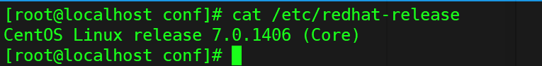

### 我的虚拟机用户名和密码：
    超级管理员：root rootroot
    普通用户：prosayj root

### 常用的命令：

**1:查看自己的系统是多少位**

    方式1：getconf LONG_BIT   32 就是32位的

    方式2：arch    i686是32位的   x86_64是64位的

---
**2:查看已安装的CentOS版本信息**

    cat /proc/version
    uname –a：
    uname –r
    lsb_release -a
    注:这个命令适用于所有的linux，包括RedHat、SUSE、Debian等发行版。
    cat /etc/issue
    cat /etc/redhat-release

---
**3:查看certos是哪个版本**

    cat /etc/redhat-release



---
**4:查看linux启动了哪些服务**

    netstat –nltp
    sshd:监听端口22  一般d都是服务端


**5:查看当前所在的工作目录**

    pwd

-------
**6:查看当前用户**

    whoami

---
**7:查看当前系统的时间**

    date

---
**8:查看根目录下有哪些内容**

    ll /
    ls /

---
**9:查看有谁在线（哪些人登陆到了服务器）**

    who

---
**10:查看最近的登陆历史记录**

    last

---
**11:查看ip地址**

    ifconfig

**12：查看防火墙状态：**

```firewall-cmd --state```