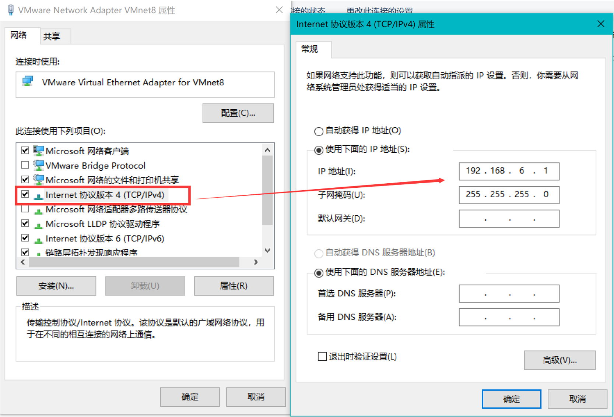

#### 两个linux镜像：
[ustc.edu](http://mirrors.ustc.edu.cn/centos/)

[distrowatch](https://distrowatch.com/index.php?distribution=centos&release=stable&month=all&year=all)

[Linux命令搜索](https://wangchujiang.com/linux-command/)

[Certos7网络配置](https://blog.csdn.net/tigaobansongjiahuan8/article/details/77825348)

---
### 我的虚拟机用户名和密码：
    超级管理员：root rootroot
    普通用户：prosayj root

### 常用的命令：

**1:查看自己的系统是多少位的**

    方式1：getconf LONG_BIT   32 就是32位的

    方式2：arch    i686是32位的   x86_64是64位的

**2:查看certos是哪个版本的**

    cat /etc/redhat-release


### ip地址配置
>1：虚拟机适配器ip地址：




---
>2：虚拟机虚拟网络编辑


---
>3：修改linux网络配置文件

``` vi /etc/sysconfig/network-scripts/ ifcfg-xxxxx ```


```
TYPE=Ethernet
PROXY_METHOD=none
BROWSER_ONLY=no
BOOTPROTO=static
DEFROUTE=yes
IPV4_FAILURE_FATAL=no
IPV6INIT=yes
IPV6_AUTOCONF=yes
IPV6_DEFROUTE=yes
IPV6_FAILURE_FATAL=no
IPV6_ADDR_GEN_MODE=stable-privacy
NAME=ens33
UUID=6c2fd94b-7884-4ae3-aca1-2dd5695ee5ab
DEVICE=ens33
ONBOOT=yes
IPADDR=192.168.6.70
NETMASK=255.255.255.0
GATEWAY=192.168.6.2
DNS1=8.8.8.8
DNS2=8.8.4.4
ZONE=
```

> 4：重启linux网络服务：

```service network restart```

### 安装jdk1.8

> 查看当前项目安装的jdk在系统中的位置：为了图方便。使用yum -y install jdk-9.0.1
安装完成之后，发现在centos7中。jdk的路径不在/usr/lib/jvm下面了。需要找到对应的路径。在此记录一下:

**1、先找到java执行文件路径 ```whereis java```输出：java: /usr/bin/java**

**2、根据执行文件找到对应的软链接指向的文件路径```ls -lrt  /usr/bin/java``` 输出：
/usr/bin/java -> /etc/alternatives/java**

**3、进入/etc/alternatives/目录，发现还不是源文件目录。继续找
```ls -lrt /etc/alternatives/java```输出：
/etc/alternatives/java -> /usr/java/jdk-9.0.1/bin/java
看到jdk字样了。应该是源文件目录了。进入到路径**


**注意：前提是jdk的版本要和linux的版本是一致的，不然会有问题**

#### 卸载：
1：查看已经安装的jdk：```rpm -qa|grep jdk```

2：卸载jdk  ```yum -y remove jdk1.8XXXXX```

3：卸载完成执行 ```java –version``` 是否还能找到命令


#### 下载jdk：
32位：```wget --no-cookies --no-check-certificate --header "Cookie: gpw_e24=http%3A%2F%2Fwww.oracle.com%2F; oraclelicense=accept-securebackup-cookie" http://download.oracle.com/otn-pub/java/jdk/8u141-b15/336fa29ff2bb4ef291e347e091f7f4a7/jdk-8u141-linux-i586.tar.gz```

64位：```wget --no-cookies --no-check-certificate --header "Cookie: gpw_e24=http%3A%2F%2Fwww.oracle.com%2F; oraclelicense=accept-securebackup-cookie" http://download.oracle.com/otn-pub/java/jdk/8u141-b15/336fa29ff2bb4ef291e347e091f7f4a7/jdk-8u141-linux-x64.tar.gz```

[迅雷下载](http://download.oracle.com/otn-pub/java/jdk/8u181-b13/96a7b8442fe848ef90c96a2fad6ed6d1/jdk-8u181-linux-x64.tar.gz)

#### 解压缩：
```tar –zxvf jdk1.8XXXX –C /usr/local```

#### 修改环境变量
	vim /etc/profile
环境变量新增配置：
```
export JAVA_HOME=/usr/lib/jdk/jdk1.8.0_181
export CLASSPATH=.:$JAVA_HOME/lib/dt.jar:$JAVA_HOME/lib/tools.jar
export PATH=$JAVA_HOME/bin:$PATH:/usr/lib/tomcat/tomcat8.5.32/bin
```
#### 使/etc/profile生效：
```source /etc/profile```
#### 验证：
```Java –varsion```


### 安装tomcat：
先检查是否安装wget下载工具：```wget```,要是没有先安装```yum wget```。解压缩以后： ```sh startup.sh```

### 修改防火墙：firewalld.service服务
查看防火墙状态：```firewall-cmd --state```

开启防火墙：```service firewalld start```

重启防火墙(1)：```service firewalld restart```

重启防火墙(修改配置后要重启防火墙)(2)：```firewall-cmd --reload```

关闭防火墙：```service firewalld stop```

查询端口是否开放：```firewall-cmd --query-port=8080/tcp```

开放80端口：```firewall-cmd --permanent --add-port=8080/tcp```

移除端口：```firewall-cmd --permanent --remove-port=8080/tcp```

#### 参数解释
    1、firwall-cmd：是Linux提供的操作firewall的一个工具
    2、--permanent：表示设置为持久；
    3、--add-port：标识添加的端口；


#### 部署jenkins

Windowns下：

    1：下载war包:
    2：运行：java –jar jenkins.war
    3：登陆：http://localhost:8080


下载插件地址：
http://updates.jenkins-ci.org/download/plugins/

重置密码
 

#### 安装gcc


安装Redis
下载安装包
wget http://download.redis.io/releases/redis-4.0.11.tar.gz

解压安装包
 编译：
make

安装
make install


Redis没有其他外部依赖，安装过程很简单。编译后在Redis源代码目录的src文件夹中可以找到若干个可执行程序，安装完后，在/usr/local/bin目录中可以找到刚刚安装的redis可执行文件。
如下图:

启动和停止Redis
启动Redis
直接启动
直接运行redis-server即可启动Redis
[root@localhost bin]# redis-server

通过初始化脚本启动Redis
在Redis源代码目录的utils文件夹中有一个名为redis_init_script的初始化脚本文件。需要配置Redis的运行方式和持久化文件、日志文件的存储位置。步骤如下：
1、配置初始化脚本
首先将初始化脚本复制到/etc/init.d 目录中，文件名为 redis_端口号，其中端口号表示要让Redis监听的端口号，客户端通过该端口连接Redis。然后修改脚本第6行的REDISPORT变量的值为同样的端口号。
2、建立以下需要的文件夹。
目录名	Value
/etc/redis	存放Redis的配置文件
/var/redis/端口号	存放Redis的持久化文件
3、修改配置文件
首先将配置文件模板（redis-4.0.2/redis.conf）复制到/etc/redis 目录中，以端口号命名（如“6379.conf”），然后按照下表对其中的部分参数进行编辑。
参数	值	说明
daemonize	yes	使Redis以守护进程模式运行
pidfile	/var/run/redis_端口号.pid	设置Redis的PID文件位置
port	端口号	设置Redis监听的端口号
dir	/var/redis/端口号	设置持久化文件存放位置
现在也可以使用下面的命令来启动和关闭Redis了
/etc/init.d/redis_6379 start
/etc/init.d/redis_6379 stop

【重中之重】让Redis随系统自动启动，这还需要对Redis初始化脚本进行简单修改，执行命令：
vim /etc/init.d/redis_6379
在打开的redis初始化脚本文件头部第四行的位置，追加下面两句
# chkconfig: 2345 90 10
# description: Redis is a persistent key-value database
追加后效果如下：

上图红色框中就是追加的两行注释，添加完毕后进行保存，即可通过下面的命令将Redis加入系统启动项里了
//设置开机执行redis脚本
chkconfig redis_6379 on

通过上面的操作后，以后也可以直接用下面的命令对Redis进行启动和关闭了，如下
service redis_6379 start
service redis_6379 stop

经过上面的部署操作后，系统重启，Redis也会随着系统自动启动，并且上面的步骤里也配置了Redis持久化，下次启动系统或Redis时，有缓存数据不丢失的好处。
停止Redis
考虑到 Redis 有可能正在将内存中的数据同步到硬盘中，强行终止 Redis 进程可能会导致数据丢失。正确停止Redis的方式应该是向Redis发送SHUTDOWN命令，方法为：
redis-cli SHUTDOWN
当Redis收到SHUTDOWN命令后，会先断开所有客户端连接，然后根据配置执行持久化，最后完成退出。
Redis可以妥善处理 SIGTERM信号，所以使用 kill Redis 进程的 PID也可以正常结束Redis，效果与发送SHUTDOWN命令一样。

Linux上传下载文件：rz sz
sz dir/*：下载dir目录下的所有文件，不包含dir下的文件夹；
sz filename1 filename2 下载多个文件
rz sz 都是针对服务器而言

1、简述
  通常，利用SSH管理远程Linux服务器时，经常需要与本地交互文件。当然，我们可以利用FTP方式，比如通过Filezilla客户端软件。不过直接使用SSH软件（SecureCRT、Xshell）自带的上传和下载功能无疑使最方便快捷的。通常SSH软件支持的文件传输协议主要有ASCII、Xmodem、Zmodem等。
  rz，sz是便是Linux/Unix同Windows进行ZModem文件传输的命令行工具。
使用前提：
	首先，你的Linux端（CentOS, Ubuntu）需要安装rz/sz命令，也就是 lszrz 包。
	其次，windows端需要支持ZModem的telnet/ssh客户端(Xshell，SecureCRT支持,好像putty不支持)，SecureCRT就可以用SecureCRT登陆到Unix/Linux主机（telnet或ssh均可）。
	运行命令rz，即是接收文件，xshell就会弹出文件选择对话框，选好文件之后关闭对话框，文件就会上传到linux里的当前目录。如果要上传文件，直接用鼠标点住文件往X-shell里面一拖即是
	运行命令 sz file 就是发文件到windows上（保存的目录是可以配置） 比ftp命令方便多了，而且服务器不用再开FTP服务了。
2、文件传输协议
  文件传输是数据交换的主要形式。在进行文件传输时，为使文件能被正确识别和传送，我们需要在两台计算机之间建立统一的传输协议。这个协议包括了文件的识别、传送的起止时间、错误的判断与纠正等内容。常见的传输协议有以下几种：
ASCII：这是最快的传输协议，但只能传送文本文件。
Xmodem：这种古老的传输协议速度较慢，但由于使用了CRC错误侦测方法，传输的准确率可高达99.6%。
Ymodem：这是Xmodem的改良版，使用了1024位区段传送，速度比Xmodem要快
Zmodem：Zmodem采用了串流式（streaming）传输方式，传输速度较快，而且还具有自动改变区段大小和断点续传、快速错误侦测等功能。这是目前最流行的文件传输协议。
ps -f |grep java

1:查看linux启动服务
netstat –nltp

Sshd:监听端口22  一般d都是服务端程序
1、日常操作命令

**查看当前所在的工作目录
pwd

**查看当前用户
Whoami

**查看当前系统的时间
date

**查看根目录下有哪些内容
ll /

**查看有谁在线（哪些人登陆到了服务器）
who  查看当前在线


**last 查看最近的登陆历史记录

**查看当前linux系统是多少位的：
getconf LONG_BIT


**查看已安装的CentOS版本信息
	cat /proc/version

	uname –a

	uname –r

	lsb_release -a
注:这个命令适用于所有的linux，包括RedHat、SUSE、Debian等发行版。


	cat /etc/issue

	cat /etc/redhat-release


2、文件系统操作
**修改ip地址
方式1:
Setup

网络配置--->设备配置--->etho-->如下--->键盘修改静态ip


确定-->保存-->保存并退出---->退出
最后重启服务：service network restart
方式2
vi /etc/sysconfig/network-scripts/ifcfg-eth0

DEVICE=eth0
TYPE=Ethernet
ONBOOT=yes     #是否开机启用
BOOTPROTO=static   #ip地址设置为静态
IPADDR=192.168.33.41
NETMASK=255.255.255.0
DEVICE=eth0
HWADDR=00:0c:29:97:e1:bb
TYPE=Ethernet
UUID=3b87fc88-529a-450d-9129-6b3de5415072
ONBOOT=yes
BOOTPROTO=none
IPADDR=192.168.33.81
#GATEWAY=xxx.xxx.xxx.xxx
NETMASK=255.255.255.0
DNS1=114.114.114.114 #根据实际情况更换
# DNS2=202.96.209.133 #根据实际情况更换
IPV6INIT=no
USERCTL=no
DEVICE=eth0


**查看ip地址
Ifconfig：

**修改主机名称
vi /etc/sysconfig/network

NETWORKING=yes
HOSTNAME=server01
**修改ip地址和主机名的映射关系
vi /etc/hosts

**切换目录
cd  /home

**创建文件夹
mkdir aaa     这是相对路径的写法
mkdir -p  aaa/bbb/ccc
mkdir  /data    这是绝对路径的写法

**删除文件夹
rmdir   可以删除空目录
rm -r aaa   可以把aaa整个文件夹及其中的所有子节点全部删除,逐步提示删除，有内而外
rm -rf aaa   强制删除aaa
rm -f 删除文件


**修改文件夹名称
mv aaa 123

**创建文件（三种方式）
	touch  123.txt   创建一个空文件;
	echo "i miss you,my baby" > 234.txt  利用重定向“>”的功能，将一条指令的输出结果写入到一个文件中，会覆盖原文件内容;
	echo " i miss you,my honny " >> 234.txt     将一条指令的输出结果追加到一个文件中，不会覆盖原文件内容
	用vi文本编辑器来编辑生成文件


用vi文本编辑器来编辑生成文件
:wq
:q!

******最基本用法
vi  345.txt
1、首先会进入“一般模式”，此模式只接受各种快捷键，不能编辑文件内容
2、按i键，就会从一般模式进入编辑模式，此模式下，敲入的都是文件内容
3、编辑完成之后，按Esc键退出编辑模式，回到一般模式；
4、再按：，进入“底行命令模式”，输入wq命令，回车即可

******一些常用快捷键
一些有用的快捷键（在一般模式下使用）：
a  在光标后一位开始插入
A   在该行的最后插入
I   在该行的最前面插入
gg   直接跳到文件的首行
G    直接跳到文件的末行
dd   删除行，如果  5dd   ，则一次性删除光标后的5行
yy  复制当前行,  复制多行，则  3yy，则复制当前行附近的3行
p   粘贴
v  进入字符选择模式，选择完成后，按y复制，按p粘贴
ctrl+v  进入块选择模式，选择完成后，按y复制，按p粘贴
shift+v  进入行选择模式，选择完成后，按y复制，按p粘贴

查找并替换（在底行命令模式中输入）
%s/sad/88888888888888     效果：查找文件中所有sad，替换为88888888888888
/you       效果：查找文件中出现的you，并定位到第一个找到的地方，按n可以定位到下一个匹配位置（按N定位到上一个）


** 移动文件
mv  haha.txt  ../123/345.txt 把haha.txt 文件移动到上级目录的123文件夹并重命名为345.txt

**拷贝文件
cp  345.txt  ../123/hello.java
cp –R 递归复制

远程拷贝文件：
 **查看文件内容
cat		somefile 一次性将文件全部输出（控制台）
more	somefle  可以翻页查看，下翻一页（空格） 上翻一页（b） 退出 q
less	somefile 可以翻页查看，下翻一页（空格）	上翻一页（b）
上翻一行（向上箭头） 下翻一行（向下箭头） 可以搜索关键字（/keyword）

tail -10 install.log  查看文件尾部的10行
tail -f install.log   文件更新跟踪，自动刷新，按照文件inode跟踪，文件重命名以后还是会跟踪这个文集。如log4j的文件10m以后会复制一份文件出来，然后重命名自己。
tail -F install.log   文件更新跟踪，自动刷新，按照文件名称来跟踪，如果文件重命名，就跟踪不到了。
head -10 install.log
3、文件权限的操作
**linux文件权限的描述格式解读
第一个字母：文件的类型常用的三种类型：
D：表示目录;
-：表示二进制文件;
l:表示软连接文件link，即：window中的快捷方式
drwxr-xr-x      （也可以用二进制表示  111 101 101  -->  755）

d：标识节点类型（d：文件夹   -：文件  l:链接）
r：可读   w：可写    x：可执行
第一组rwx：  表示这个文件的拥有者对它的权限：可读可写可执行
第二组r-x：  表示这个文件的所属组对它的权限：可读，不可写，可执行
第三组r-x：  表示这个文件的其他用户（相对于上面两类用户）对它的权限：可读，不可写，可执行


**修改文件权限
chmod g-rw haha.dat    表示将haha.dat对所属组的rw权限取消
chmod o-rw haha.dat 	表示将haha.dat对其他人的rw权限取消
chmod u+x haha.dat      表示将haha.dat对所属用户的权限增加x

也可以用数字的方式来修改权限
chmod 664 haha.dat
就会修改成   rw-rw-r--

如果要将一个文件夹的所有内容权限统一修改，则可以-R参数
chmod -R 770 jdk1.7.0_45/
chown root:root jdk1.7.0_45/    <只有root能执行>
chown –R root:root jdk1.7.0_45/
-R参数是递归 处理目录下的所有文件以及子文件夹

目录没有执行权限的时候普通用户不能进入
文件只有读写权限的时候普通用户是可以删除的(删除文件不是修改它,是操作父及目录),只要父级目录有执行和修改的权限
注意：有写保护的文件是可以删除的，删除有写保护的文件并不代表你修改了它
删除文件是修改了父目录的内容，而不是待删除文件的内容。
Sudo useradd start.bat  ---->执行本条指令的时候使用root的身份。
**linux远程拷贝文件
scp 	123.txt  root@192.168.33.1：/home  拷贝到root下的home目录
4、基本的用户管理
**添加用户
useradd  angela
要修改密码才能登陆
passwd angela  按提示输入密码即可

** 修改用户密码
修改用户名密码s
1、首先，要用CRT软件连接Linux系统。
2、首选，确认是用root用户登录系统的。
输入命令： id ，查看登录用户信息。
3、若修改root自己的密码，直接输入 passwd .
输入两遍，新密码即可。
4、若修改其他用户，如oracle 的密码，可直接输入passwd oracle.
输入两遍性新密码即可。
5、这样就修改成功了。
** 切换用户
su yangjian

**为用户配置sudo权限
用root编辑 vi /etc/sudoers
在文件的如下位置，为hadoop添加一行即可
root    ALL=(ALL)       ALL
hadoop  ALL=(ALL)       ALL

然后，hadoop用户就可以用sudo来执行系统级别的指令
[hadoop@shizhan ~]$ sudo useradd huangxiaoming
5、系统管理操作
**查看主机名
hostname

**修改主机名(重启后无效)
hostname hadoop

**修改主机名(重启后永久生效)
vi /ect/sysconfig/network
**修改IP(重启后无效)
ifconfig eth0 192.168.12.22

**修改IP(重启后永久生效)
vi /etc/sysconfig/network-scripts/ifcfg-eth0
DEVICE=eth0
HWADDR=00:0c:29:97:e1:bb
TYPE=Ethernet
UUID=3b87fc88-529a-450d-9129-6b3de5415072
ONBOOT=yes
BOOTPROTO=none
IPADDR=192.168.33.81
#GATEWAY=xxx.xxx.xxx.xxx
NETMASK=255.255.255.0
DNS1=114.114.114.114 #根据实际情况更换
# DNS2=202.96.209.133 #根据实际情况更换
IPV6INIT=no
USERCTL=no
DEVICE=eth0


mount ****  挂载外部存储设备到文件系统中
mkdir   /mnt/cdrom      创建一个目录，用来挂载
mount -t iso9660 -o ro /dev/cdrom /mnt/cdrom/     将设备/dev/cdrom挂载到 挂载点 ：  /mnt/cdrom中

*****umount
umount /mnt/cdrom


**统计文件或文件夹的大小
du -sh  /mnt/cdrom/Packages
df -h    查看磁盘的空间
**关机
halt
**重启
reboot


mount **  挂载外部存储设备到文件系统中
mkdir   /mnt/cdrom      创建一个目录，用来挂载
mount -t iso9660 -o ro /dev/cdrom /mnt/cdrom/     将设备/dev/cdrom挂载到 挂载点 ：  /mnt/cdrom中

*****umount
umount /mnt/cdrom


**统计文件或文件夹的大小
du -sh  /mnt/cdrom/Packages
df -h    查看磁盘的空间
****关机
halt
****重启
reboot


**配置主机之间的免密ssh登陆
假如 A  要登陆  B
在A上操作：
%%首先生成密钥对
ssh-keygen   (提示时，直接回车即可)
%%再将A自己的公钥拷贝并追加到B的授权列表文件authorized_keys中
ssh-copy-id   B


**后台服务管理
service

crond===>定时任务

linux的软件安装

**如何上传安装包到服务器如何下载服务软件到本地
**可以使用图形化工具
如： filezilla
**可以使用sftp工具：
alt+p 调出后，用put命令上传
上传（如果不cd指定目录，则上传到当前用户的主目录）：
先切换到要上传的目录


** 下载服务器文件到本地
alt + p
lac 本地目录 服务器待下载文件目录


重复下载会覆盖资源

**lrzsz
** rz

**关于压缩包
%%压缩解压缩%%
解压gz文件：  gzip -d access.log.gz
** 压缩 gzip


** 解压缩 gzip -d

**打包 tar –cvf
tar –cvf  目标打包文件名称 源待打包文件s
c:创建一个tar包，v 显示过程，f 文件


**解包 tar –xvf

%%一次性完成打包&&压缩的操作%%
产生压缩包：tar -zcvf

解压缩包：tar –zxvf -C

解压到目标目录 tar –zxvf jdk.tar.gz –c
tar -zxvf jdk-7u45-linux-x64.tar.gz  -C ../softApp/


**安装jdk
一、查看Jdk的安装路径：
whereis java
which java （java执行路径）
echo $JAVA_HOME
echo $PATH


备注：如果是windows中，可以使用:

set java_home:查看JDK安装路径
java -version:查看JDK版本


二、卸载旧版本的JDK：


1. 确定JDK的版本：

rpm -qa | grep jdk

rpm -qa | grep gcj


可能的结果是：

libgcj-4.1.2-42.el5
java-1.4.2-gcj-compat-1.4.2.0-40jpp.115


2.然后卸载：

 yum -y remove java-1.4.2-gcj-compat-1.4.2.0-40jpp.115

如果这中方法不行，可以使用如下的方法卸载：


1）卸载系统自带的jdk版本：
   查看自带的jdk：
   #rpm -qa|grep gcj
   可能看到如下类似的信息：
   libgcj-4.1.2-44.el5
   java-1.4.2-gcj-compat-1.4.2.0-40jpp.115
   使用rpm -e --nodeps 命令删除上面查找的内容：
   #rpm -e –nodeps java-1.4.2-gcj-compat-1.4.2.0-40jpp.115

2）卸载rpm安装的jkd版本
   查看安装的jdk：
   #rpm -qa|grep jdk
   可能看到如下类似的信息：
   jdk-1.6.0_22-fcs
   卸载：
   #rpm -e --nodeps jdk-1.6.0_22-fcs


3）找到jdk安装目录的_uninst子目录

·在shell终端执行命令./uninstall.sh即可卸载jdk


三、下载新版本的JDK

官方地址： http://www.oracle.com/technetwork/java/javase/downloads/index.htm


四、安装JDK（以JDK1.6为例子）

1、jdk1.6提供以下两种自解压文件：
   1）jdk-6u22-linux-i586.bin
   2）jdk-6u22-linux-i586-rpm.bin
2、我下载的是jdk-6u22-linux-i586-rpm.bin
3、给所有用户添加可执行的权限
   #chmod +x jdk-6u22-linux-i586-rpm.bin
4、执行该文件，命令如下：
   #./jdk-6u22-linux-i586-rpm.bin
   执行后会解压出一些rpm软件包，其中有jdk-6u22-linux-i586.rpm这是主程式包，接下来就是安装这个主程序包。
5.、切换到root用户，进入jdk-6u22-linux-i586.rpm存放的目录，执行如下命令：
    rpm -ivh jdk-6u22-linux-i586.rpm
   安装软件会将JDK自动安装到 /usr/java/jdk-1.6.0_22-fcs目录下

在linux上安装时，常常会碰到如下的Fail：

RPM should not be used directly install RPM packages, use Alien instead!

这时用这个命令即可：

 rpm -ivh jdk-6u22-linux-i586.rpm --nodeps --force


五、配置环境变量：

 如果所有用户都想共享jdk的环境变量，可以通过如下方式设置。

   （但建议最好不要这样，万一有其他用户使用其他JDK就会受到影响。）
    在/etc/profile文件中加入:
　　# vi /etc/profile 　　
　　export JAVA_HOME=/usr/java/jdk-1.6.0_22-fcs
　　export CLASSPATH=$CLASSPATH:$JAVA_HOME/lib:$JAVA_HOME/jre/lib
　　export PATH=$JAVA_HOME/bin:$JAVA_HOME/jre/bin:$PATH:$HOME/bin

   注：修改文件后要想马上生效还要运行# source /etc/profile不然只能在下次重进此用户时生效。
　　记得CLASSPATH路径中加入$CLASSPATH:不然可能在解释执行class文件时会报错。

 当然也可以用更加彻底的方法：reboot命令来重启机器。


        有时你可能会发现/etc/profile中配置的环境变量在系统重新启动或者重新使用SSH连接后失效了，其原因有可能是

        1. 某个非root用户下环境变量是生效的，但是切换到root用户后，使用javac等命令失效。

        2.写入到/etc/profile的环境变量在重新启动后会自动生效。未重新启动之前每次打开终端都需如你所述执行source命令。


附： 怎样安装tar类型的JDK：


首先将*.tar.gz解压

tar -xzvf *.tar.gz
假设得到的文件夹为java

将其移动到/usr/中

sudo mv java /usr/local
然后设置环境变量：

sudo vim /etc/profile
打开文件

在结尾处输入：

export JAVA_HOME=/usr/local/java export JRE_HOME=/usr/local/java/jre　 export CLASSPATH=.:$JAVA_HOME/lib:$JRE_HOME/lib:$CLASSPATH export PATH=$JAVA_HOME/bin:$JRE_HOME/bin:$PATH
Ubuntu 中修改默认jdk

update-alternatives --install /usr/bin/java java /usr/localjava/bin/java 300 update-alternatives --install /usr/bin/javac javac /usr/local/java/bin/javac 300
通过这一步将我们安装的jdk加入java选单。

update-alternatives --config java
选择默认的jdk

java -version
**解压安装包
 见上图
which java

**修改环境变量
vi /etc/profile
在文件最后添加
export  JAVA_HOME=/root/softApp/jdk1.7.0_45
export PATH=$PATH:$JAVA_HOME/bin
保存退出
注意jdk的版本一定要和linux系统版本一致


**然后重新加载环境变量
source /etc/profile


**安装Tomcat
wget http://mirrors.cnnic.cn/apache/tomcat/tomcat-8/v8.0.42/bin/apache-tomcat-8.0.42.tar.gz

1.上传apache-tomcat-7.0.68.tar.gz到Linux上
Alt + p
2.解压tomcat
tar -zxvf apache-tomcat-7.0.68.tar.gz -C /usr/local/
3.启动tomcat
/usr/local/apache-tomcat-7.0.68/bin/startup.sh
进入tomcat的bin下启动：./startup.sh
进入tomcat的bin下关闭：./shutdown.sh

4.查看tomcat进程是否启动
jps

5.查看tomcat进程端口
netstat -anpt | grep 2465
6.通过浏览器访问tomcat
http://192.168.0.101:8080/
7：开放8080端口：
vi /etc/sysconfig/iptables
-A RH-Firewall-1-INPUT -m state --state NEW -m tcp -p tcp --dport 8080 -j ACCEPT
service iptables restart

**安装rpm包软件，如mysql
%%查看系统中安装的rpm包
rpm -qa | grep mysql


%%上传rpm安装包
MySQL-client-5.5.48-1.linux2.6.x86_64.rpm
MySQL-server-5.5.48-1.linux2.6.x86_64.rpm
per * .rpm

%%安装perl依赖
rpm -ivh perl*
《可能会提示有包冲突，解决： rpm -e 冲突包名 --nodeps 》

%%安装server
rpm -ivh MySQL-server-5.5.48-1.linux2.6.x86_64.rpm
如果成功，会看到进度条，最后，有关于root密码设置的提示，一定要记下来
这个版本的提示是，先启动server
service mysql start
然后/usr/bin/mysql_secure_installation 命令去交互式修改root密码

%%修改密码时，提示需要先安装client
rpm -ivh MySQL-client-5.5.48-1.linux2.6.x86_64.rpm

客户端安装成功后，记得还要用/usr/bin/mysql_secure_installation 命令去交互式修改root密码

%%登录验证
mysql -uroot -proot
** 安装mysql
linux系统CentOS7
到http://mirrors.sohu.com/mysql/ 下载想要的mysql版本
这里用到的是C:\Users\Administrator\Desktop\mysql-5.6.20.tar.gz
也可以直接在shell端提要供下载文件的详细url用wget命令下载到指定文件夹内
wget是一个从网络上自动下载文件的自由工具，它支持HTTP、HTTPS和FTP协议。
-c : 接着下载没下载完的文件，允许断点续传，对应的详细参数名是 --continue
-P : 将文件保存到指定目录，对应的详细参数名是 --directory-prefix
--progress : 没有参数名缩写格式，指定下载进度条的形式有 dot 和 bar(默认)两种
wget -c http://mirrors.sohu.com/mysql/MySQL-5.6/mysql-5.6.26-linux-glibc2.5-x86_64.tar.gz -P /usr/local/src --progress=bar
或者详细参数名方式
wget --continue http://mirrors.sohu.com/mysql/MySQL-5.6/mysql-5.6.26-linux-glibc2.5-x86_64.tar.gz --directory-prefix=/usr/local/src --progress=bar


/usr/local/src是用户存放源码程序的位置
但其实这一版mysql不需要cmake再make和make install编译源代码安装，直接安装即可


shell端
下面执行安装mysql_install_db时需要先安装perl-Module-Install.noarch
yum install -y perl-Module-Install.noarch


还需要安装以下依赖
yum install libaio*


以绝对路径创建文件夹（此步可省略）
mkdir创建文件夹，稍后用来存放要安装的mysql
-m : 对新建目录设置存取权限
-p : 此时若路径中的某些目录尚不存在，系统将自动建立好那些尚不存在的目录
mkdir -m777 -p /usr/local/mysql


进入到安装包目录
cd /usr/local/src


解压缩文件到当前文件夹
tar备份,压缩与解压缩,Linux命令，也是一个工具
-z : 表示 tar 包是被 gzip 压缩过的，所以解压时需要用 gunzip 解压
-x : 从 tar 包中把文件提取出来
-v : 显示详细信息
-f xxx.tar.gz : 指定被处理的文件是 xxx.tar.gz
tar.gz的用tar zxvf解压，tar.bz2的用tar jxvf解压
tar -zxvf mysql-5.6.26-linux-glibc2.5-x86_64.tar.gz


跳到上一级（此步可省略）
cd ../


将mv /usr/local/src/下的mysql-5.6.26-linux-glibc2.5-x86_64移动到/usr/local/下并重命名为mysql
cp
mv既可以重命名，又可以移动文件或文件夹，名前面无目录则只在当前目录下改名（其实相当移动覆盖）
当不清楚当前目录下文件结构时可输入ls获得，ls -all更详细的文件结构包括各文件权限
mv /usr/local/src/mysql-5.6.26-linux-glibc2.5-x86_64  /usr/local/mysql


=============================================================================================
新建组mysql加入系统，为mysql服务添加组和用户，建立用户和组为了安全起见，不让mysql服务操作本身用到的文件以外的文件，所以最好新建linux用户安装mysql
groupadd mysql


增加mysql这个用户,作为系统账号,同时添加到mysql组理,主目录是/usr/local/mysql
useradd命令用来建立用户帐号和创建用户的起始目录，该命令使用权限是终极用户。新建用户密码为空
－g : 指定用户所属的起始群组。
－d : 指定用户登入时的启始目录。
－s : 指定用户登入后所使用的shell。-s /sbin/nologin 是不让登录shell
-g后第一个mysql是组名，第二个mysql是新建的用户名，新建用户信息可在/etc/passwd文件中查到
useradd -r -g mysql mysql -d /usr/local/mysql


设置mysql用户的密码，设置密码时输入的密码不可见，这里设为123456，回车确认
passwd mysql


将/usr/local/mysql目录下归属到mysql用户及mysql组
chown 命令 更改某个文件或目录的属主和属组。
-R : 递归式地改变指定目录及其下的所有子目录和文件的拥有者。
-v : 显示chown命令所做的工作。
mysql:mysql，第一个mysql是用户名，第二个mysql是组名
chown -R mysql:mysql /usr/local/mysql


由当前用户切换到mysql用户
su 用户名，是切换到其他用户，但是不切换环境变量
su - 用户名，是完整的切换到一个用户环境
su mysql


退出su mysql用户
exit
=============================================================================================


安装数据库，也可以把该步骤放在上面的su mysql与exit之间执行
--user : 所指定的用户是想要运行mysqld进程用户名。这个是可变的，不一定非要是mysql。设置这个用户以后，所有通过mysqld进程创建的文件都会属于这个用户。网上的教程里多用mysql用户是为了在生产环境中更方便管理。
/usr/local/mysql/scripts/mysql_install_db --user=mysql --basedir=/usr/local/mysql --datadir=/usr/local/mysql/data


进入mysql配置文件目录
cd /usr/local/mysql/support-files


复制mysql服务启动配置文件到/etc/下并重命名为my.cnf，/etc/my.cnf如存在则输入y和回车覆盖
配置文件，如果没有的话，mysql所有的参数将会是默认值
cp my-default.cnf /etc/my.cnf


将mysql加入到可控制启动的服务的文件夹内，并命名mysql，即service可控制的服务名，至此可用service mysql start控制启动mysql
/etc/init.d 是/etc/rc.d/init.d的链接，在/etc/init.d添加一个文件会同步在/etc/rc.d/init.d下添加一个相同文件
cp mysql.server /etc/init.d/mysql


修改自启动调用的路径。其实若mysql的安装目录是/usr/local/mysql,则可省略此步
vim编辑器，是vi的升级版本，它不仅兼容vi的所有指令，而且还有一些新的特性在里面
进入后按键盘i进行编辑，修改如下俩值
basedir=/usr/local/mysql
datadir=/usr/local/mysql/data
编辑后按esc键输入:wq按回车保存。:q!是不保存退出
vim /etc/init.d/mysql


让mysql服务加入到开机启动指令管理的服务列表中
chkconfig命令主要用来更新（启动或停止）和查询系统服务的运行级信息。谨记chkconfig不是立即自动禁止或激活一个服务，它只是简单的改变了符号连接
--add : 增加所指定的系统服务，让chkconfig指令得以管理它，并同时在系统启动的叙述文件内增加相关数据。服务脚本必须存放在/etc/ini.d/目录下
chkconfig --add mysql


开机自启动mysql服务
on : 针对的服务有等级限制，具体查询chkconfig详细
chkconfig mysql on


配置环境变量，这个文件是每个用户登录时都会运行的环境变量设置
在最下面添加下面两个值
export MYSQL_HOME="/usr/local/mysql"
export PATH="$PATH:$MYSQL_HOME/bin"
然后保存
vim /etc/profile


让修改的profile文件立即生效
. /etc/profile


启用mysql，或者命令systemctl start mysql
service mysql start


设置mysql的root用户密码，此处设成123456，此root用户与linux不是一个
mysqladmin -u root password '123456'


登陆mysql，用刚才设置的密码
mysql -u root -p


允许使用用户名root密码123456从任何主机连接到mysql服务器
该创建的root账号只是从外部访问的账号，与内部linux访问该mysql时所用root不同，内部linux访问该mysql的root账号也不是linux的系统root账号
mysql>GRANT ALL PRIVILEGES ON *.* TO 'root'@'%' IDENTIFIED BY '123456' WITH GRANT OPTION;


刷新权限
mysql>FLUSH PRIVILEGES;


退出mysql
mysql>exit;


开启防火墙mysql3306端口的外部访问
CentOS升级到7之后，使用firewalld代替了原来的iptables。下面记录如何使用firewalld开放Linux端口
--zone : 作用域，网络区域定义了网络连接的可信等级。这是一个一对多的关系，这意味着一次连接可以仅仅是一个区域的一部分，而一个区域可以用于很多连接
--add-port : 添加端口与通信协议，格式为：端口/通讯协议，协议是tcp 或 udp
--permanent : 永久生效，没有此参数系统重启后端口访问失效
firewall-cmd --zone=public --add-port=3306/tcp --permanent


重启防火墙
firewall-cmd --reload


附一：
CentOS7弃用以前的iptables使用firewall做防火墙，如果要尝试之前防火墙修改开放端口方式可以关闭firewall，安装以前的iptables

停止firewall，与之对应的是开启。systemctl start firewalld
systemctl stop firewalld

禁止firewall开机启动
systemctl disable firewalld

安装iptables-services
yum install iptables-services

打开iptables的配置文件
vi文本编辑器
输入以下内容后保存
# Firewall configuration written by system-config-firewall
# Manual customization of this file is not recommended.
*filter
:INPUT ACCEPT [0:0]
:FORWARD ACCEPT [0:0]
:OUTPUT ACCEPT [0:0]
-A INPUT -m state --state ESTABLISHED,RELATED -j ACCEPT
-A INPUT -p icmp -j ACCEPT
-A INPUT -i lo -j ACCEPT
-A INPUT -m state --state NEW -m tcp -p tcp --dport 22 -j ACCEPT
-A INPUT -m state --state NEW -m tcp -p tcp --dport 80 -j ACCEPT
-A INPUT -m state --state NEW -m tcp -p tcp --dport 3306 -j ACCEPT
-A INPUT -j REJECT --reject-with icmp-host-prohibited
-A FORWARD -j REJECT --reject-with icmp-host-prohibited
COMMIT
如果配置文件中已有内容则只需添加要打开的端口号即可，添加如下行
-A INPUT -m state --state NEW -m tcp -p tcp --dport 3306 -j ACCEPT
添加打开的端口号一定在-A INPUT -j REJECT --reject-with icmp-host-prohibited和-A FORWARD -j REJECT --reject-with icmp-host-prohibited之前
vi /etc/sysconfig/iptables

:wq! #保存退出后重启，对应的开始命令是systemctl start iptables
systemctl restart iptables

设置iptables防火墙开机启动
systemctl enable iptables


附二：
忘记root密码后，如何更改密码
停止mysql服务，或者命令systemctl stop mysql
service mysql stop

进入/usr/local/mysql
cd $MYSQL_HOME

通过mysqld_safe启动mysql，并且启动mysql时不启动grant-tables授权表
./bin/mysqld_safe --basedir=/usr/local/mysql --datadir=/usr/local/mysql/data --skip-grant-tables &

登陆mysql
mysql -u root mysql

修改root密码
mysql>UPDATE user SET password=PASSWORD("new_password") WHERE user='root';

刷新
mysql>FLUSH PRIVILEGES;

退出mysql
mysql>exit;


附三：
firewall防火墙默认的几个zone（由firewalld 提供的区域按照从不信任到信任的顺序排序）：

drop
任何流入网络的包都被丢弃，不作出任何响应，只允许流出的网络连接。即使开放了某些服务(比如http)，这些服务的数据也是不允许通过的。

block
任何进入的网络连接都被拒绝，并返回 IPv4 的 icmp-host-prohibited 报文或者 IPv6 的 icmp6-adm-prohibited 报文。只允许由该系统初始化的网络连接。

public（默认）
用以可以公开的部分。你认为网络中其他的计算机不可信并且可能伤害你的计算机，只允许选中的服务通过。

external
用在路由器等启用伪装的外部网络。你认为网络中其他的计算机不可信并且可能伤害你的计算机，只允许选中的服务通过。

dmz
用以允许隔离区（dmz）中的电脑有限地被外界网络访问，只允许选中的服务通过。

work
用在工作网络。你信任网络中的大多数计算机不会影响你的计算机，只允许选中的服务通过。

home
用在家庭网络。你信任网络中的大多数计算机不会影响你的计算机，只允许选中的服务通过。

internal
用在内部网络。你信任网络中的大多数计算机不会影响你的计算机，只允许选中的服务通过。

trusted
允许所有网络连接，即使没有开放任何服务，那么使用此zone的流量照样通过（一路绿灯）。


附四：
下面两种命令作用相同
systemctl [stop|start|restart] 服务名
service 服务名 [stop|start|restart]


附五：
以下其余四个GRANT例子
给来自192.168.155.1的用户user1分配可对数据库dbname的tablename表进行SELECT,INSERT,UPDATE,DELETE,CREATE,DROP等操作的权限，并设定密码为123456。
对表操作权限还有好多如ALTER等
mysql>GRANT SELECT,INSERT,UPDATE,DELETE,CREATE,DROP ON dbname.tablename TO 'user1'@'192.168.155.1' IDENTIFIED BY '123456';

给来自192.168.155.1的用户user2分配可对数据库dbname所有表进行所有操作的权限，并设定口令为123456。
mysql>GRANT ALL PRIVILEGES ON dbname.* TO 'user2'@'192.168.155.1' IDENTIFIED BY '123456';

给来自192.168.155.1的用户user3分配可对所有数据库的所有表进行所有操作的权限，并设定口令为123456。
mysql>GRANT ALL PRIVILEGES ON *.* TO 'user3'@'192.168.155.1' IDENTIFIED BY '123456';

给本机用户user4分配可对所有数据库的所有表进行所有操作的权限，并设定口令为123456。
mysql>GRANT ALL PRIVILEGES ON *.* TO 'user4'@'localhost' IDENTIFIED BY '123456';


一些问题：
解决CentOS系统Yum出现"Cannot find a valid baseurl for repo"问题
解决centerox ping不通问题


