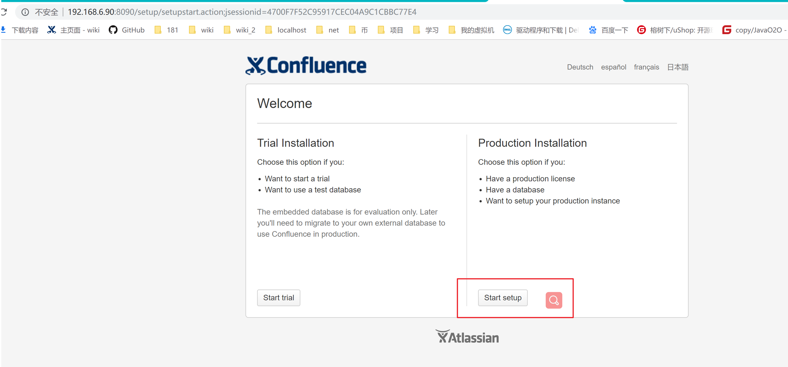
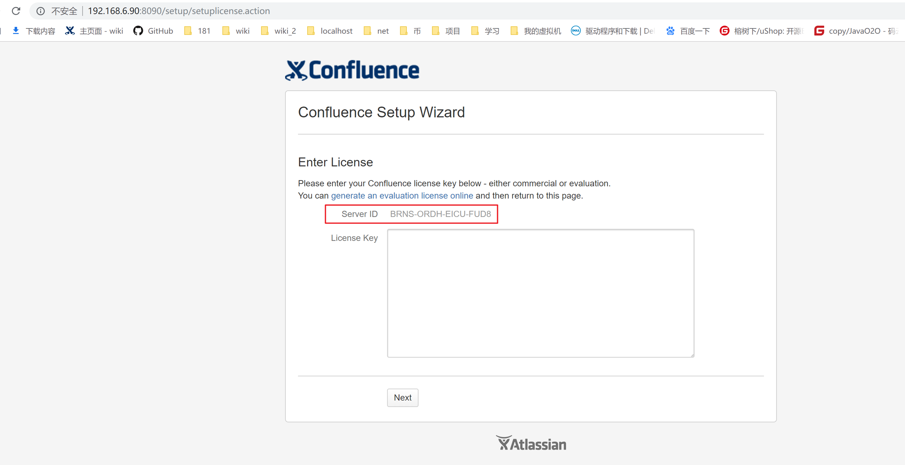
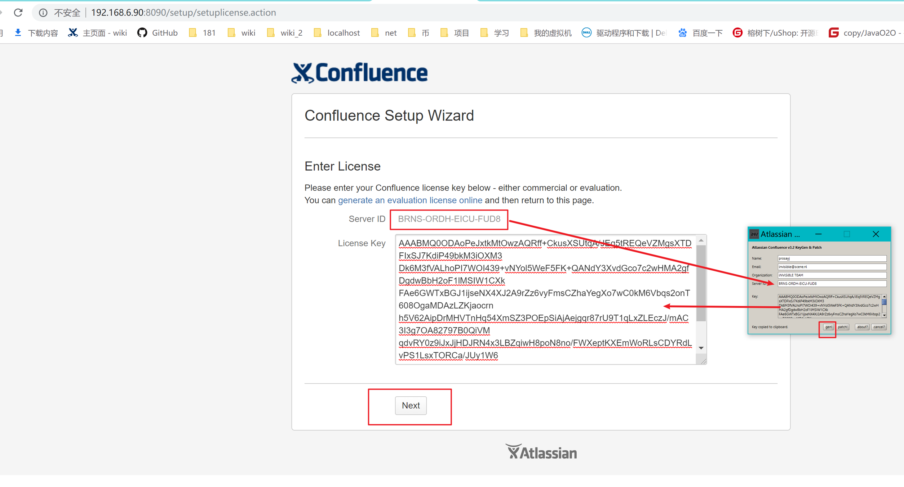
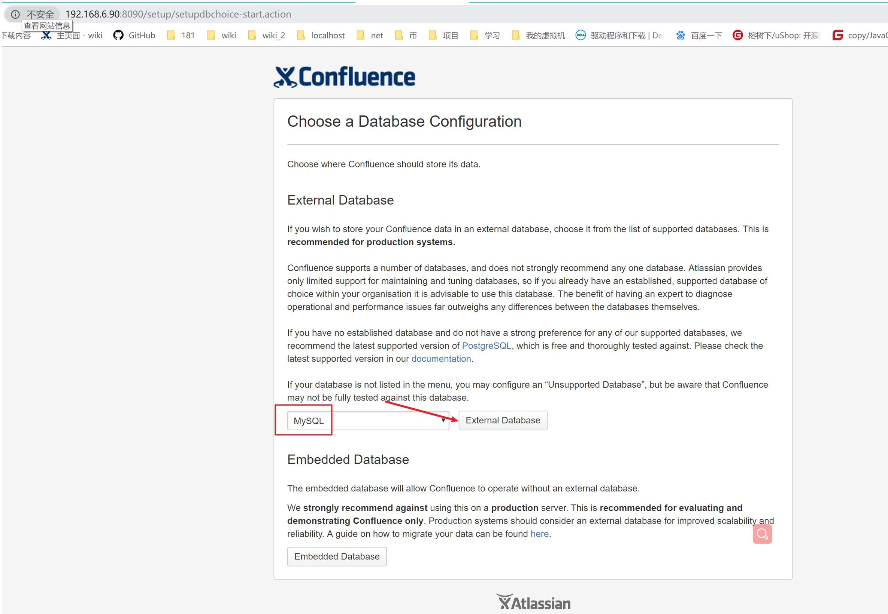
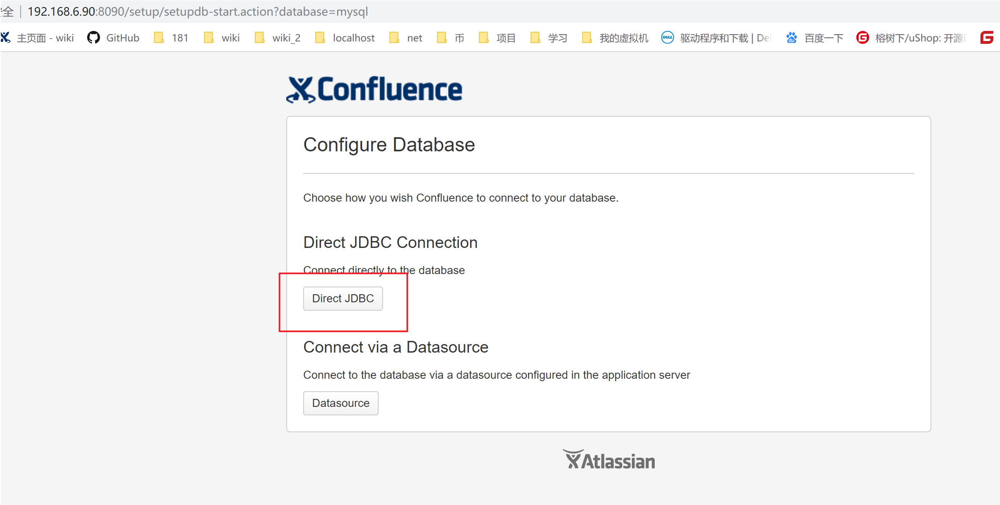
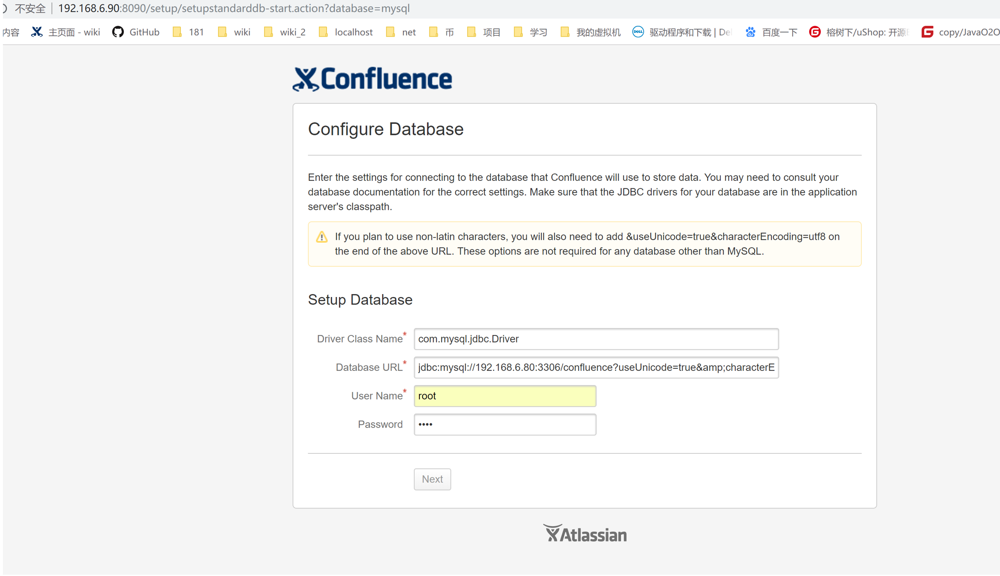
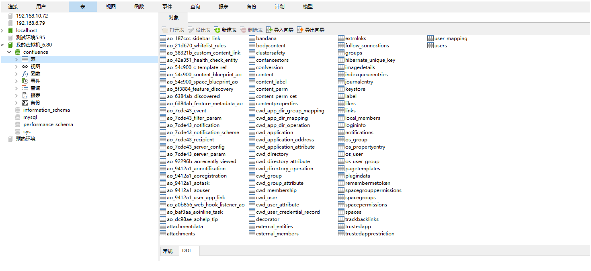
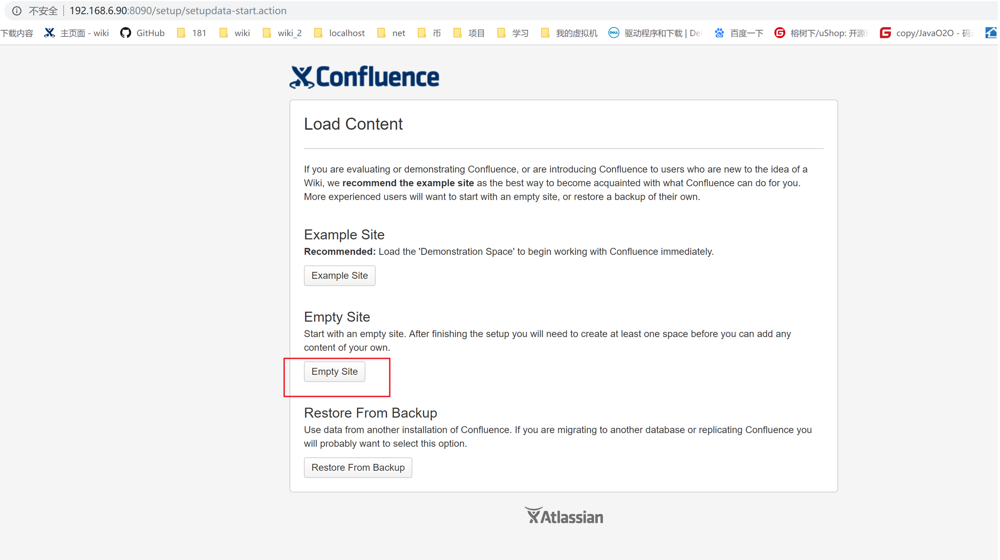
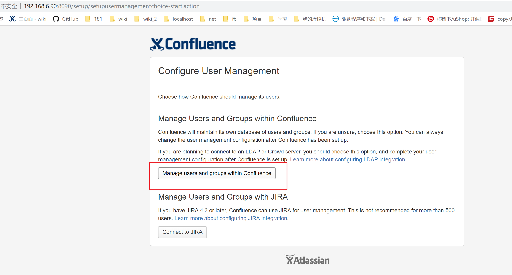
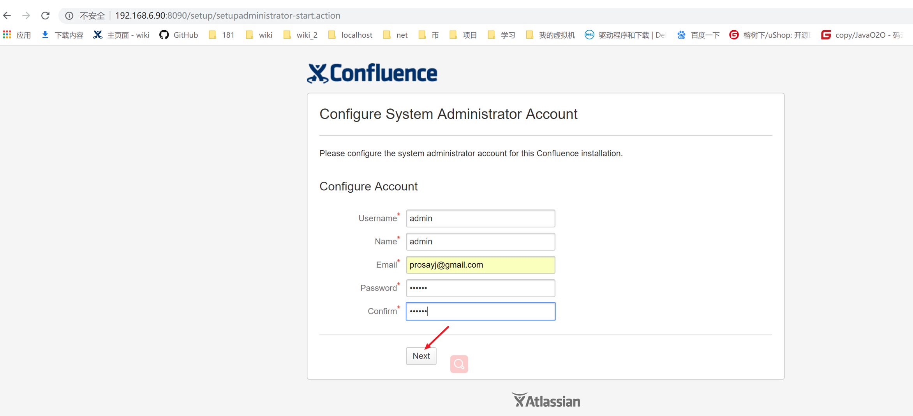

## 00_CentOS7安装Conflience


[参考教程1](https://blog.csdn.net/qq_41806316/article/details/81943596)   [参考教程2](https://www.ilanni.com/?p=11989)


## 在安装之前，需要一下几个包：
``` shell
atlassian-confluence-5.6.6-x64
atlassian-extras-3.2.jar
Confluence-5.6.6-language-pack-zh_CN.jar
mysql-connector-java-5.1.39-bin.jar
confluence_keygen.jar
```


### 1:下载
[我的百度云盘](https://pan.baidu.com/s/1A5L8rHxQK4APLOqvQ1YJHA)

wget https://www.atlassian.com/software/confluence/downloads/binary/atlassian-confluence-5.6.6-x64.bin


2:rz这几个文件并且修改执行权限
chmod 755 atlassian-confluence-5.6.6-x64.bin atlassian-extras-3.2.jar Confluence-5.6.6-language-pack-zh_CN.jar mysql-connector-java-5.1.39-bin.jar

[root@localhost confluence-wiki]# pwd
/com/prosayj/src/confluence-wiki
[root@localhost confluence-wiki]# chmod 755 atlassian-confluence-5.6.6-x64.bin atlassian-extras-3.2.jar Confluence-5.6.6-language-pack-zh_CN.jar mysql-connector-java-5.1.39-bin.jar 
[root@localhost confluence-wiki]# pwd
/com/prosayj/src/confluence-wiki
[root@localhost confluence-wiki]# ll
total 265492
-rwxr-xr-x. 1 root root 267843959 Oct  8 22:41 atlassian-confluence-5.6.6-x64.bin
-rwxr-xr-x. 1 root root    155443 Aug 28  2017 atlassian-extras-3.2.jar
-rw-r--r--. 1 root root   1924995 Oct  8 23:14 confluence5.6.6-crack.zip
-rwxr-xr-x. 1 root root    363012 Aug 28  2017 Confluence-5.6.6-language-pack-zh_CN.jar
-rwxr-xr-x. 1 root root    578992 Aug 28  2017 confluence_keygen.jar
-rwxr-xr-x. 1 root root    989497 Aug 28  2017 mysql-connector-java-5.1.39-bin.jar
[root@localhost confluence-wiki]#


3：安装：
3.1：执行安装命令：
./atlassian-confluence-5.6.6-x64.bin

注意：为了方便：选择默认安装路径o,1不是l哦，i

[root@localhost confluence-wiki]# pwd
/com/prosayj/src/confluence-wiki
[root@localhost confluence-wiki]# ./atlassian-confluence-5.6.6-x64.bin 
Unpacking JRE ...
Starting Installer ...
Oct 08, 2018 10:50:51 PM java.util.prefs.FileSystemPreferences$2 run
INFO: Created system preferences directory in java.home.

This will install Confluence 5.6.6 on your computer.
OK [o, Enter], Cancel [c]
o
Choose the appropriate installation or upgrade option.
Please choose one of the following:
Express Install (uses default settings) [1], Custom Install (recommended for advanced users) [2, Enter], Upgrade an existing Confluence installation [3]
1^H1^C[root@localhost confluence-wiki]# clear
[root@localhost confluence-wiki]# ./atlassian-confluence-5.6.6-x64.bin 
Unpacking JRE ...
Starting Installer ...
Oct 08, 2018 10:52:03 PM java.util.prefs.FileSystemPreferences$2 run
INFO: Created system preferences directory in java.home.

This will install Confluence 5.6.6 on your computer.
OK [o, Enter], Cancel [c]
o
Choose the appropriate installation or upgrade option.
Please choose one of the following:
Express Install (uses default settings) [1], Custom Install (recommended for advanced users) [2, Enter], Upgrade an existing Confluence installation [3]
1
See where Confluence will be installed and the settings that will be used.
Installation Directory: /opt/atlassian/confluence 
Home Directory: /var/atlassian/application-data/confluence 
HTTP Port: 8090 
RMI Port: 8000 
Install as service: Yes 
Install [i, Enter], Exit [e]
i

Extracting files ...

Please wait a few moments while Confluence starts up.
Launching Confluence ...
Installation of Confluence 5.6.6 is complete
Your installation of Confluence 5.6.6 is now ready and can be accessed via
your browser.
Confluence 5.6.6 can be accessed at http://localhost:8090
Finishing installation ...
[root@localhost confluence-wiki]# 


Please wait a few moments while Confluence starts up.
Launching Confluence ...


可以看到：

默认安装路径：/opt/atlassian/confluence

默认项目路径：/var/atlassian/application-data/confluence

默认端口号：8090

3.2：开放端口号：8090
firewall-cmd --permanent --add-port=8090/tcp

3.3：重启防火墙：
firewall-cmd --reload

3.4：登陆
http://192.168.6.90:8090



3.5：点击Start setup 下一步，记录下server ID准备破解

BRNS-ORDH-EICU-FUD8

4：破解
4.1：停止服务
/etc/init.d/confluence stop

[root@localhost confluence-wiki]# /etc/init.d/confluence stop
executing using dedicated user
If you encounter issues starting up Confluence, please see the Installation guide at http://confluence.atlassian.com/display/DOC/Confluence+Installation+Guide

Server startup logs are located in /opt/atlassian/confluence/logs/catalina.out
Using CATALINA_BASE:   /opt/atlassian/confluence
Using CATALINA_HOME:   /opt/atlassian/confluence
Using CATALINA_TMPDIR: /opt/atlassian/confluence/temp
Using JRE_HOME:        /opt/atlassian/confluence/jre/
Using CLASSPATH:       /opt/atlassian/confluence/bin/bootstrap.jar:/opt/atlassian/confluence/bin/tomcat-juli.jar
Using CATALINA_PID:    /opt/atlassian/confluence/work/catalina.pid
Tomcat stopped.

4.2：进入目录删除atlassian-extras开头的6个文件
cd /opt/atlassian/confluence/confluence/WEB-INF/lib/ && ll |grep atlassian-extra

rm -fr atlassian-extra*

[root@localhost lib]# cd /opt/atlassian/confluence/confluence/WEB-INF/lib/ && ll |grep atlassian-extra 
-rw-r--r--. 1 root root   14935 Dec  1  2014 atlassian-extras-api-3.2.jar
-rw-r--r--. 1 root root   21788 Dec  1  2014 atlassian-extras-common-3.2.jar
-rw-r--r--. 1 root root   38244 Dec  1  2014 atlassian-extras-core-3.2.jar
-rw-r--r--. 1 root root    5171 Dec  1  2014 atlassian-extras-decoder-api-3.2.jar
-rw-r--r--. 1 root root    6668 Dec  1  2014 atlassian-extras-decoder-v2-3.2.jar
-rw-r--r--. 1 root root   68438 Dec  1  2014 atlassian-extras-legacy-3.2.jar
[root@localhost lib]# rm -fr atlassian-extra*
[root@localhost lib]# cd /opt/atlassian/confluence/confluence/WEB-INF/lib/ && ll |grep atlassian-extra 
[root@localhost lib]#

4.3：复制扩展包
把上面几步中下载的atlassian-extras-3.2.jar、Confluence-5.6.6-language-pack-zh_CN.jar、mysql-connector-java-5.1.39-bin.jar三个jar文件复制到/opt/atlassian/confluence/confluence/WEB-INF/lib目录下

cp atlassian-extras-3.2.jar Confluence-5.6.6-language-pack-zh_CN.jar mysql-connector-java-5.1.39-bin.jar /opt/atlassian/confluence/confluence/WEB-INF/lib/

三个包的解释：

atlassian-extras-3.2.jar文件是和license相关的；

Confluence-5.6.6-language-pack-zh_CN.jar是confluence中文语言包；

mysql-connector-java-5.1.39-bin.jar是confluence连接mysql数据库相关的jar包。

atlassian所有产品的中文语言包，都可以通过以点我:下载到

mysql-connector-java-5.1.39-bin.jar文件可以连接mysql5.7及其以下的mysql版本，可以参考我：

5：启动服务初始化配置服务
5.1：启动并使用注册机获取注册码
/etc/init.d/confluence start

win下运行破解jar包：java -jar confluence_keygen.jar 并输入注册码



5.2:点击next配置mysql
jdbc:mysql://192.168.6.80:3306/confluence?useUnicode=true&amp;characterEncoding=UTF-8

数据库用户名：root

数据库密码：root

注意：在连接数据库之前，需要新建空的数据库：confluence








注意：配置完成数据库点击next以后可能需要一段时间来初始化数据库表，需要耐心等待，如果中途刷新了浏览器导致失败则重启服务即可。

5.3：初始化服务、管理员用户名和密码配置





超级管理员用户名：admin 、密码 admin


6：confluence的文件配置：
cat /var/atlassian/application-data/confluence/confluence.cfg.xml


``` shell
[root@localhost confluence-wiki]# cat /var/atlassian/application-data/confluence/confluence.cfg.xml

```
``` xml
<?xml version="1.0" encoding="UTF-8"?>

<confluence-configuration>
   <setupStep>complete</setupStep>
   <setupType>custom</setupType>
   <buildNumber>5639</buildNumber>
   <properties>
      <property name="admin.ui.allow.daily.backup.custom.location">false</property>
      <property name="admin.ui.allow.manual.backup.download">false</property>
      <property name="admin.ui.allow.site.support.email">false</property>
      <property name="atlassian.license.message">AAABMQ0ODAoPeJxtkMtOwzAQRff+CkusXSUtqA/JEq5tREQeVZMgsXTDFIxSJ7KdiP49bkM3iOXM3 Dk6M3fVALhoPI7WOI439+vNYol5WeF5FK+QANdY3XvdGco7c2wHMA2gfDgdwBbH2oF1lMSIW1CXk FAe6GWTxBGJ1ijseNX4XJ2A9rZz6vyFmsCZhaYegXo7wC0kM6Vbqs2onT608OgaMDAzLZKjaocrn h5V62AipDrMHVTnHq54XmSZ3POEpSiAjAejgqr87rU9T1qLxZLEczJ/mAC3I3g7OA82797B0QiVM qdvRY0z9iJxJjHDJRN4x3LBZqiwH8poN8no/FWXeptKXEmWoRLsCDYRdLvPS1LsxTORCa/JUy1W6 Nc2TNNE3Kr/5XaDbT6Vgz+//AHa4YnwMC0CFBXazlzGEaVVqOe+5G6gYvkjaMz8AhUAjAfFYuDC2 DdyrlLQ/mjwljR5MBU=X02fb</property>
      <property name="attachments.dir">${confluenceHome}/attachments</property>
      <property name="confluence.setup.server.id">BRNS-ORDH-EICU-FUD8</property>
      <property name="confluence.webapp.context.path"></property>
      <property name="hibernate.c3p0.acquire_increment">1</property>
      <property name="hibernate.c3p0.idle_test_period">100</property>
      <property name="hibernate.c3p0.max_size">30</property>
      <property name="hibernate.c3p0.max_statements">0</property>
      <property name="hibernate.c3p0.min_size">0</property>
      <property name="hibernate.c3p0.timeout">30</property>
      <property name="hibernate.connection.driver_class">com.mysql.jdbc.Driver</property>
      <property name="hibernate.connection.isolation">2</property>
      <property name="hibernate.connection.password">root</property>
      <property name="hibernate.connection.url">jdbc:mysql://192.168.6.80:3306/confluence?useUnicode=true&amp;amp;characterEncoding=UTF-8;</property>
      <property name="hibernate.connection.username">root</property>
      <property name="hibernate.database.lower_non_ascii_supported">true</property>
      <property name="hibernate.dialect">com.atlassian.hibernate.dialect.MySQLDialect</property>
      <property name="hibernate.setup">true</property>
      <property name="lucene.index.dir">${localHome}/index</property>
      <property name="webwork.multipart.saveDir">${localHome}/temp</property>
   </properties>
</confluence-configuration>
```

7：confluence迁移：
先把原来的confluence备份文件上传到confluence后台，然后还原

http://192.168.6.90:8090/admin/backup.action


可以创建软连接来快速启动：

ln -s /etc/init.d/confluence /usr/local/bin/confluence


启动：confluence start

停止：confluence stop

重启：confluence restart


