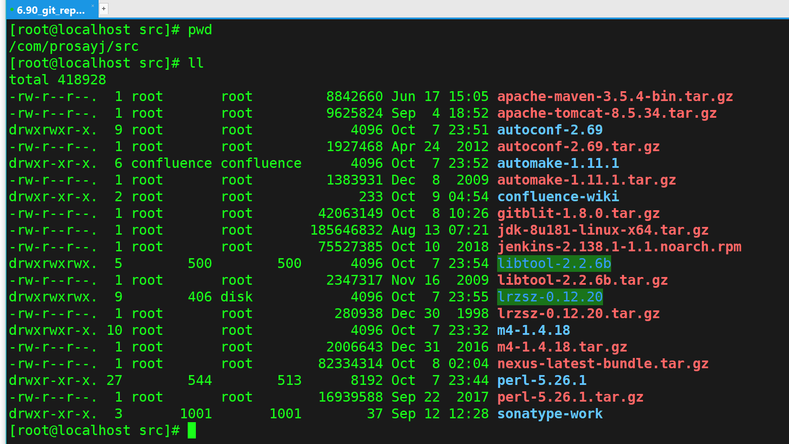
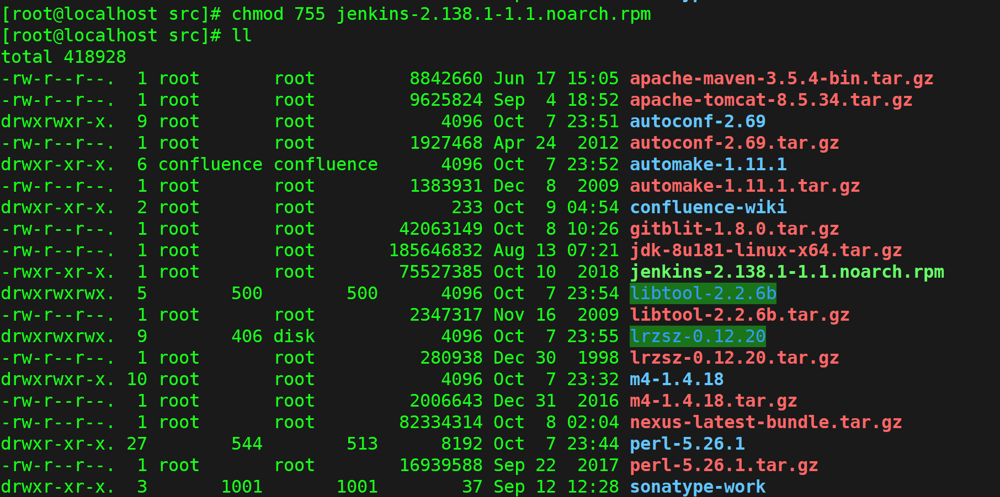
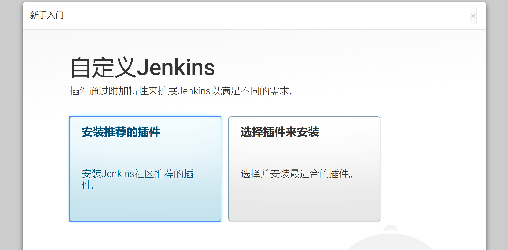

## 01_CentOS7安装Jenkins

1：下载Jenkins源码包
官网下载页面：点我

wget https://pkg.jenkins.io/redhat-stable/jenkins-2.138.1-1.1.noarch.rpm

注意：wget 网速比较慢，可以使用迅雷下载，然后sz到服务器。安装Jenkins之前先要安装jdk

java -version

2:修改成可执行权限：
chmod 755 jenkins-2.138.1-1.1.noarch.rpm 

3：安装：
 rpm -ivh --prefix=/com/prosayj/server/jenkins-2.138.1-1.1.noarch jenkins-2.138.1-1.1.noarch.rpm 

rpm包安装异常，–prefix 参数不能重定位，安装到另一个目录的原因，报错如下：

[root@localhost src]# rpm -ivh --prefix=/com/prosayj/server/jenkins-2.138.1-1.1.noarch jenkins-2.138.1-1.1.noarch.rpm 
warning: jenkins-2.138.1-1.1.noarch.rpm: Header V4 DSA/SHA1 Signature, key ID d50582e6: NOKEY
error: package jenkins is not relocatable

使用下面的命令查看rpm包是否可以重定位，也就是安装到另一个目录：

 

rpm -qpi jenkins-2.138.1-1.1.noarch.rpm | head

warning: jenkins-2.138.1-1.1.noarch.rpm: Header V4 DSA/SHA1 Signature, key ID d50582e6: NOKEY
Name : jenkins
Version : 2.138.1
Release : 1.1
Architecture: noarch
Install Date: (not installed)
Group : Development/Tools/Building
Size : 75724161
License : MIT/X License, GPL/CDDL, ASL2
Signature : DSA/SHA1, Wed 12 Sep 2018 11:05:09 PM EDT, Key ID 9b7d32f2d50582e6
Source RPM : jenkins-2.138.1-1.1.src.rpm

从结果看到 
Relocations: (not relocatable)

是无法修改安装目录的，也就是不能重定位，只有去掉 –prefix参数了。

rpm -ivh jenkins-2.138.1-1.1.noarch.rpm

[root@localhost src]# rpm -ivh jenkins-2.138.1-1.1.noarch.rpm 
warning: jenkins-2.138.1-1.1.noarch.rpm: Header V4 DSA/SHA1 Signature, key ID d50582e6: NOKEY
Preparing... ################################# [100%]
Updating / installing...
1:jenkins-2.138.1-1.1 ################################# [100%]

4：启动服务
service jenkins start

启动服务报错如下：

[root@localhost src]# service jenkins start
Starting jenkins (via systemctl): Job for jenkins.service failed because the control process exited with error code. See "systemctl status jenkins.service" and "journalctl -xe" for details.
[FAILED]

查看错误原因：systemctl status jenkins.service

● jenkins.service - LSB: Jenkins Automation Server
Loaded: loaded (/etc/rc.d/init.d/jenkins; bad; vendor preset: disabled)
Active: failed (Result: exit-code) since Wed 2018-10-10 02:52:35 EDT; 45s ago
Docs: man:systemd-sysv-generator(8)
Process: 12184 ExecStart=/etc/rc.d/init.d/jenkins start (code=exited, status=1/FAILURE)

Oct 10 02:52:35 localhost.localdomain systemd[1]: Starting LSB: Jenkins Automation Server...
Oct 10 02:52:35 localhost.localdomain runuser[12189]: pam_unix(runuser:session): session opened for user jenkins by (uid=0)
Oct 10 02:52:35 localhost.localdomain jenkins[12184]: Starting Jenkins bash: /usr/bin/java: No such file or directory
Oct 10 02:52:35 localhost.localdomain jenkins[12184]: [FAILED]
Oct 10 02:52:35 localhost.localdomain systemd[1]: jenkins.service: control process exited, code=exited status=1
Oct 10 02:52:35 localhost.localdomain systemd[1]: Failed to start LSB: Jenkins Automation Server.
Oct 10 02:52:35 localhost.localdomain systemd[1]: Unit jenkins.service entered failed state.
Oct 10 02:52:35 localhost.localdomain systemd[1]: jenkins.service failed.

 

 

https://blog.csdn.net/u013066244/article/details/78569976

 

5:配置Jenkins：
5.1：修改/添加jdk的路径
vi /etc/init.d/jenkins

# see http://www.nabble.com/guinea-pigs-wanted-----Hudson-RPM-for-RedHat-Linux-td25673707.html
candidates="
/etc/alternatives/java
/usr/lib/jvm/java-1.8.0/bin/java
/usr/lib/jvm/jre-1.8.0/bin/java
/usr/lib/jvm/java-1.7.0/bin/java
/usr/lib/jvm/jre-1.7.0/bin/java
/usr/bin/java
"
for candidate in $candidates

启动：service jenkins start 继续报错：

[root@localhost ~]# service jenkines start
Redirecting to /bin/systemctl start jenkines.service
Failed to start jenkines.service: Unit not found.

systemctl start jenkins 报错：

[root@localhost ~]# systemctl start jenkins
Warning: jenkins.service changed on disk. Run 'systemctl daemon-reload' to reload units.

 

启动：service jenkins start 成功：

开放端口号：

firewall-cmd --permanent --add-port=8080/tcp

firewall-cmd --reload 

6：初始化：
 

http://192.168.6.90:8080

 

[root@localhost secrets]# cat /var/lib/jenkins/secrets/initialAdminPassword 
ff766b8c0045422ab7cc88cf5cd56e3b
[root@localhost secrets]#

安装完成！

Jenkins配置明天再写：