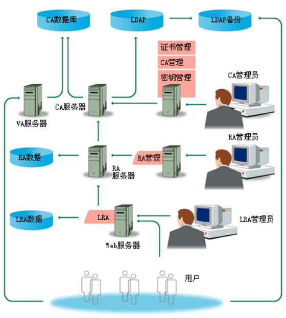

# 电子实名认证服务

# 一些概念

https://www.cnblogs.com/sddai/p/5667472.html

# RA和CA
## 概念：
- RA：证书注册审批系统。(Register Authority) 该系统具有证书的申请、审批、下载、OCSP、LDAP等一系列功能，为整个机构体系提供电子认证服务。
- 签发的数字证书可以存放于IC卡、硬盘或软盘等介质中。RA系统是整个CA中心得以正常运营不可缺少的一部分。
- RA作为CA认证体系中的一部分，能够直接从CA提供者那里继承CA认证的合法性。能够使客户以自己的名义发放证书，便于客户开展工作。

注册中心负责审核证书申请者的真实身份，在审核通过后，负责将用户信息通过网络上传到认证中心，由认证中心负责最后的制证处理。证书的吊销、更新也需要由注册机构来提交给认证中心做处理。总的来说，认证中心是面向各注册中心的，而注册中心是面向最终用户的，注册机构是用户与认证中心的中间渠道。

#  公钥基础设施PKI

** 公钥基础设施（Public Key Infrastructure，简称PKI） ** 是目前网络安全建设的基础与核心，是电子商务安全实施的基本保障。
是一种遵循标准的利用公钥加密技术为电子商务的开展提供一套安全基础平台的技术和规范。
因此，对PKI技术的研究和开发成为目前信息安全领域的热点。本文对PKI技术进行了全面的分析和总结，其中包括PKI组成、证书认证机构CA、PKI应用、应用编程接口和PKI标准等，并对CA的开发做了简要分析。
PKI 的核心组成部分CA( Certification Authority)，即认证中心，它是数字证书的签发机构。数字证书，有时被称为数字身份证，是一个符合一定格式的电子文件，用来识别电子证书持有者的真实身份。

## PKI 简介

### 背景
随着网络技术和信息技术的发展，电子商务已逐步被人们所接受，并在得到不断普及。

但由于各种原因，国内电子商务的安全性仍不能得到有效的保障。

在常规业务中，交易双方现场交易，可以确认购买双方的身份。利用商场开具的发票和客户现场支付商品费用，无须担心发生纠纷和无凭证可依。
但通过网上进行电子商务交易时，由于交易双方并不现场交易，因此，无法确认双方的合法身份，同时交易信息是交易双方的商业秘密，在网上传输时必须保证安全性，防止信息被窃取；双方的交易非现场交易，一旦发生纠纷，必须能够提供仲裁。

> **[info] 电子交易的互联网用户所面临的安全问题有:**
> - **保密性 ：**如何保证电子商务中涉及的大量保密信息在公开网络的传输过程中不被窃取；
> - **完整性 ：**如何保证电子商务中所传输的交易信息不被中途篡改及通过重复发送进行虚假交易；
> - **身份认证与授权 ：**在电子商务的交易过程中，如何对双方进行认证，以保证交易双方身份的正确性；
> - **抗抵赖 ：**在电子商务的交易完成后，如何保证交易的任何一方无法否认已发生的交易。这些安全问题将在很大程度上限制电子商务的进一步发展，因此如何保证Internet 网上信息传输的安全，已成为发展电子商务的重要环节。

因此，在电子商务中，必须从技术上保证在交易过程中能够实现 **身份认证、安全传输、不可否认性、数据完整性**。在采用数字证书认证体系之前，交易安全一直未能真 正得到解决。由于数字证书认证技术采用了加密传输和数字签名，能够实现上述要求，因此在国内外电子商务中，都得到了广泛的应用。

为解决这些Internet 的安全问题，世界各国对其进行了多年的研究，初步形成了一套完整的Internet 安全解决方案：即目前被广泛采用的 **PKI 技术(Public Key Infrastructure-公钥基础设施)** 

PKI（公钥基础设施）技术采用证书进行公钥管理，通过第三方的可信任机构-- **认证中心CA(Certificate Authority)**，把用户的公钥和用户的其他标识信息（如用户名称、e-mail、身份 证号等）捆绑在一起，在Internet 网上验证用户的身份。PKI把公钥密码和对称密码结合起来，在Internet网上实现密钥的自动管理，保证网上数据的安全传输。

目前，通用的办法是采用基于PKI结构结合数字证书，通过把要传输的数字信息进行加密，保证信息传输的保密性、完整性，签名保证身份的真实性和抗抵赖。

因此，从大的方面来说，所有提供 **公钥加密** 和 **数字签名** 服务的系统，都可归结为PKI系统的一部分。
PKI的主要目的是：** 通过自动管理密钥和证书，为用户建立起一个安全的网络运行环境，使用户可以在多种应用环境下方便的使用加密和数字签名技术，从而保证网上数据的机密性、完整性、有效性。**

> **[info] 注：数据的机密性是指：**
> - 数据在传输过程中，不能被非授权者偷看；
> - 数据的完整性是指数据在传输过程中不能被非法篡改；
> - 数据的有效性是指数据不能被否认。

###  PKI 的基本定义与组成
一个有效的PKI系统必须是 **安全的** 和 **透明的**，用户在获得加密和数字签名服务时，不需要详细地了解PKI的内部运作机制。

在一个典型、完整和有效的PKI系统中，除 **证书的创建和发布**，特别是 **证书的撤销** ，一个可用的PKI产品还必须提供相应的 **密钥管理服务**，包括密钥的备份、恢复和更新等。

没有一个好的密钥管理系统，将极大影响一个PKI系统的规模、可伸缩性和在协同网络中的运行成本。

在一个企业中，PKI系统必须有能力为一个用户管理多对密钥和证书；能够提供安全策略编辑和管理工具，如密钥周期和密钥用途等。

PKI发展的一个重要方面就是标准化问题，它也是建立互操作性的基础。目前，PKI标准化主要有两个方面：一是RSA公司的公钥加密标准PKCS（Public Key Cryptography Standards）,它定义了许多基本PKI部件，包括数字签名和证书请求格式等；二是由Internet工程任务组IETF（Internet Engineering Task Force）和PKI工作组PKIX（Public Key Infrastructure Working Group）所定义的一组具有互操作性的公钥基础设施协议。在今后很长的一段时间内，PKCS和PKIX将会并存，大部分的PKI产品为保持兼容性，也将会对这两种标准进行支持。

- PKI 的基本定义十分简单，所谓PKI 就是一个用公钥概念、技术实施、提供安全服务的具有普适性的安全基础设施。

- PKI 是一种新的安全技术，它由公开密钥密码技术、数字证书、证书发放机构（CA）和关于公开密钥的安全策略等基本成分共同组成的。

- PKI 是利用公钥技术实现电子商务安全的一种体系，是一种基础设施，网络通讯、网上交易是利用它来保证安全的。

从某种意义上讲，PKI 包含了**安全认证系统**，即安全认证系统-CA 系统是PKI 不可缺的组成部分。 

PKI 是一种新的安全技术，它由公开密钥密码技术、数字证书、证书发放机构（CA）和关于公开密钥的安全策略等基本成分共同组成的。PKI 是利用公钥技术实现电子商务安全的一种体系，是一种基础设施，网络通讯、网上交易是利用它来保证安全的。从某种意义上讲，PKI 包含了安全认证系统，即安全认证系统-CA 系统是PKI 不可缺的组成部分。