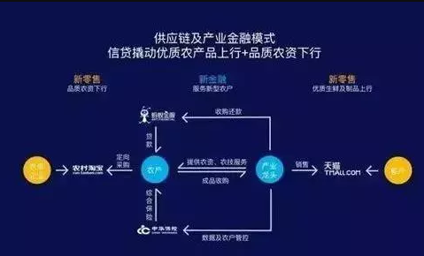

https://mp.weixin.qq.com/s?__biz=MzU5ODcwNTAyMQ==&mid=2247484373&idx=2&sn=5e65221bba232a1b85e38d9b54dfec4b&chksm=fe4155c7c936dcd12f2e2ed1584925ac8e835fbad3a393a95847778ee24ee44a372687b9b16b&mpshare=1&scene=1&srcid=0220redu3prXVNxtvtQWEX7Q#rd

# 国内十大供应链金融企业模式分析

# 蚂蚁金服供应链模式分析（农村供应链为例）

据报道，农联中鑫是中华保险与蚂蚁金服在共同的农村金融发展战略基础上强强联合的产物，经历了三个发展阶段，初步确立了“互联网+融资+保险+农业供应链一体化”的服务模式。
“农联中鑫”是tech和fin联姻结“果”， 作为第一家专门以信贷+保险模式服务三农群体的公司，致力于为广大新型农业经营主体、职业农民提供“互联网+融资+保险+农业供应链”一体化创新服务，助力农业供给侧改革。

当前农村金融发展滞后特别是农业信贷短缺的一个重要原因，就是农户抵押物缺乏、且农户缺乏官方的信用记录，而蚂蚁金服的优势就在于海量数据的积累，既有淘宝交易数据、支付宝支付数据、蚂蚁信用积分，甚至还有一些与生活场景关联起来的便利。

其只需要做的就是，结合自身优势禀赋，与产业链各方合作寻求金融解决方案。为此，蚂蚁金服农村金融方面开始了一些尝试。

**具体模式整理如下:**

例如，在内蒙古，蚂蚁金服与中华保险联手，为蒙羊集团、科尔沁牛业等大型养殖集团提供从贷款到销售的供应链金融服务。

在农村要建立农村信用体系，真正实现将信用转化为财富，既需要数据采集和积累，更需要风控机制的支持。蚂蚁金服有海量数据、有强大后台信息技术支持，而中华保险有大量农村保险客户，且有风险分散和管控手段。