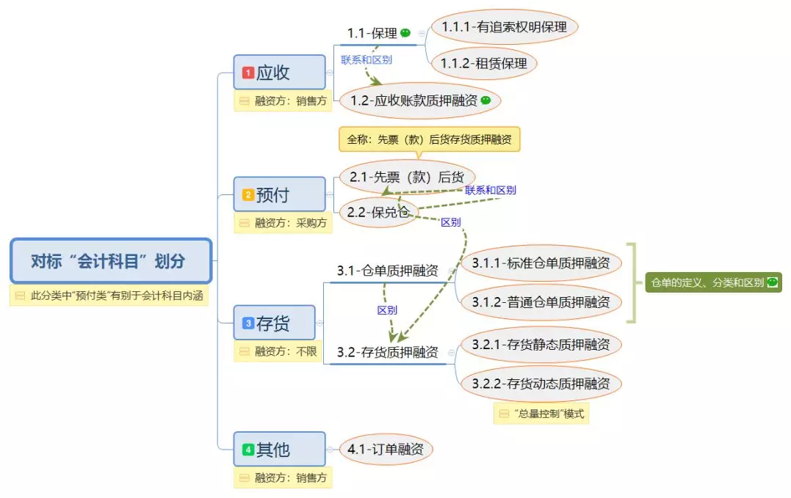
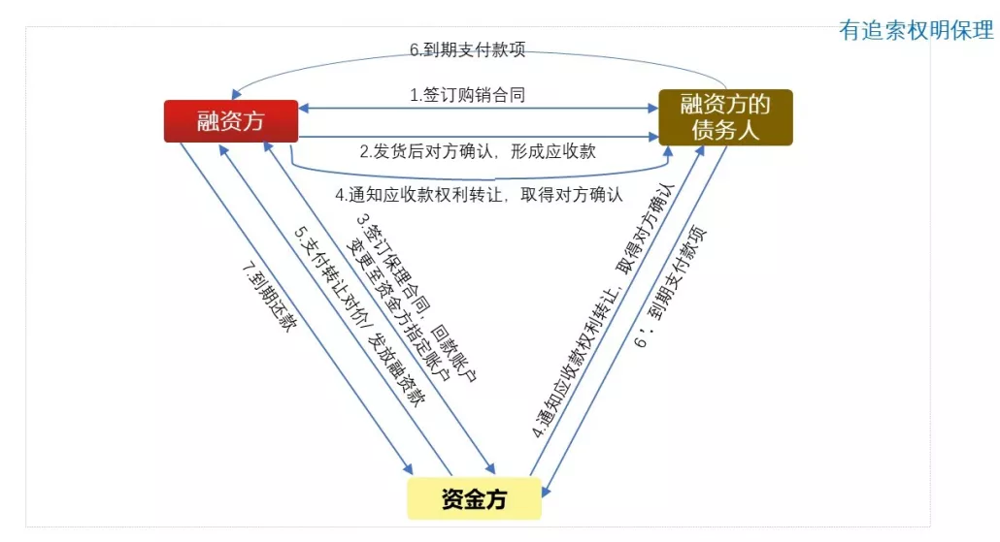
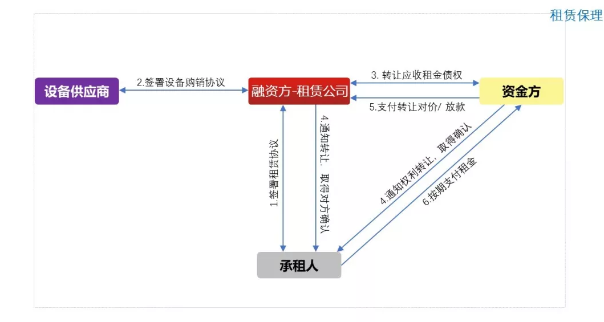
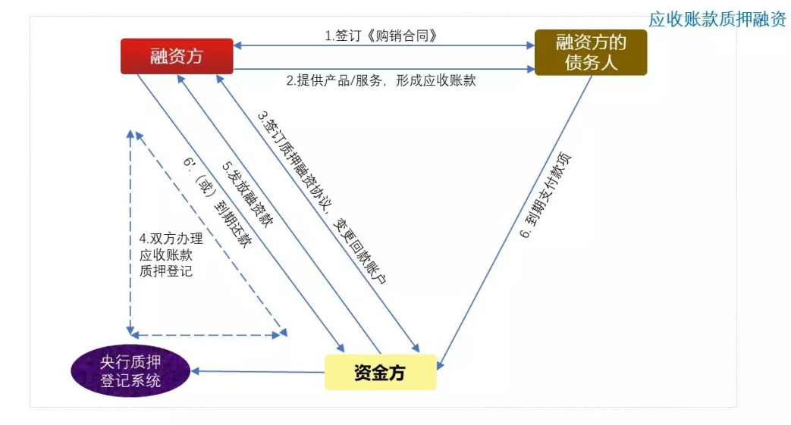
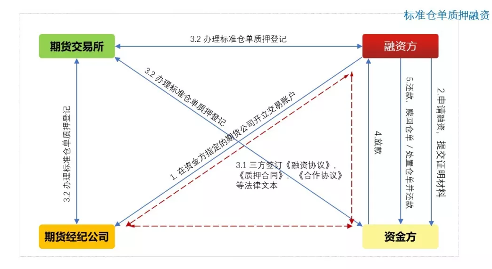
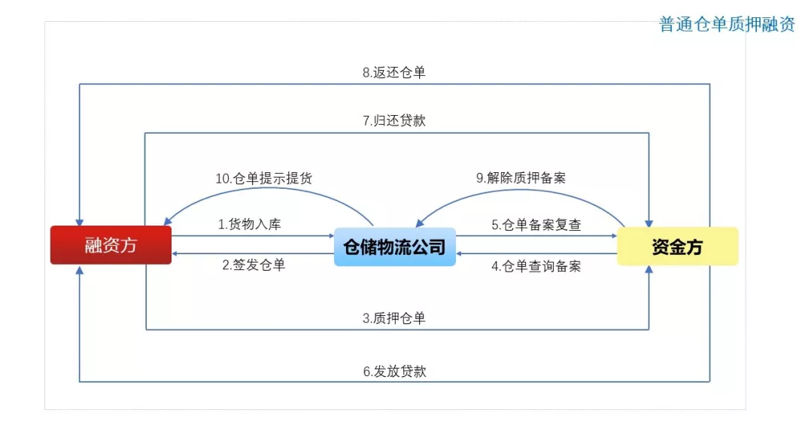
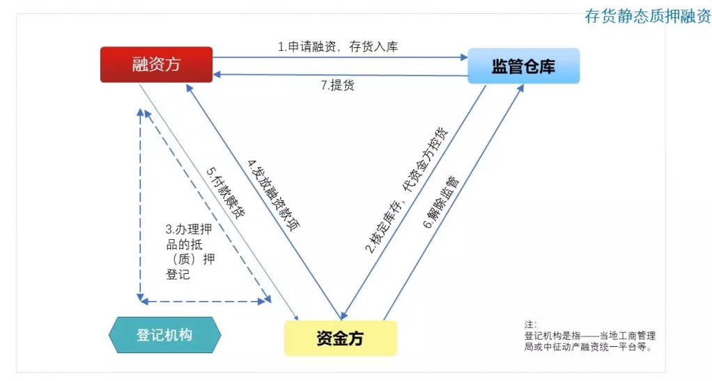
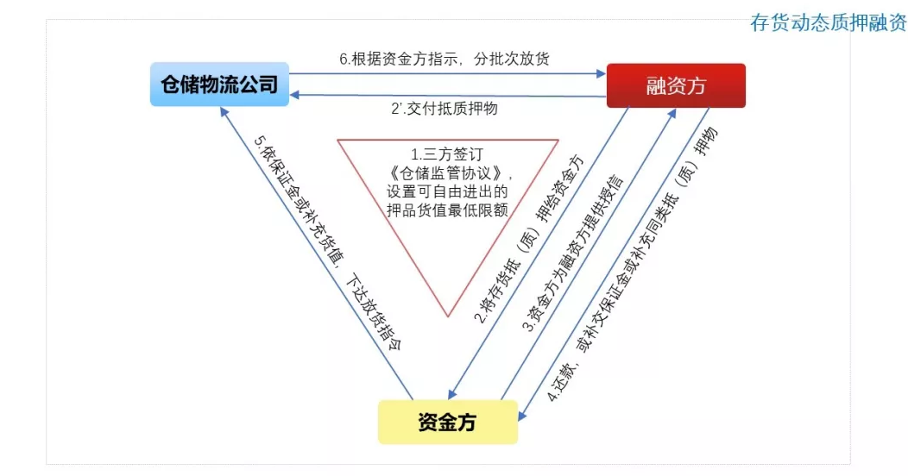
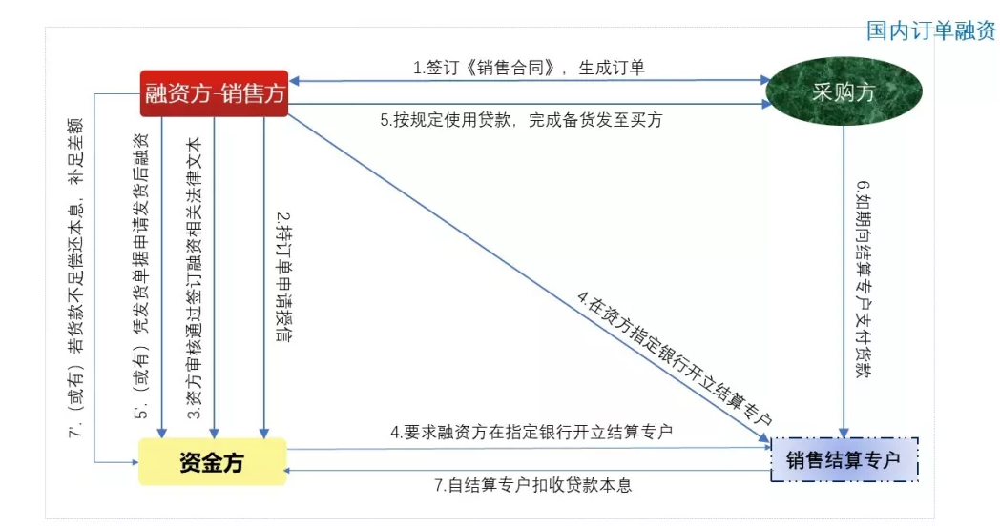

[图解10种常见供应链金融产品](https://mp.weixin.qq.com/s/L2O5Xfjh41sbBwPmX5Q52g)

# 1.“应收类”产品

## 1.1 保理

是指资金方（银行或商业保理公司等）与融资方签署保理合同，融资方将其在国内采用赊销方式完成商品销售或提供服务所形成的应收账款转让给资金方，并由资金方为其提供融资、应收账款管理，账款催收和坏账担保等综合性金融服务。
保理产品种类繁多，详见 链接文章①:[《国内保理业务分类》](./国内保理业务分类.md)。当然，保理业务的细分种类远不止于此，厚朴保理的李书文（总）有专著《商业保理理论与实务》，有兴趣的朋友可以阅读。
本文选择以下两种保理业务进行说明：

### 1.1.1:有追索权明保理

**简明释义:**
> 保理业务的一种。“有追索权”是指:无论应收账款因何原因不能收回，保理商都有权向融资方索回已付融资款项；“明保理”是指，应收账款的转让通知卖方并经其确认。

**适用行业:**
> 包括但不限于以下行业：电信、租赁、医疗、航空、铁路交通、电子设备制造等。

**综合项:**
- 参 与 方：融资方，融资方债务人，资金方。
- 融资用途：不限。
- 担保方式：信用。

**融资背景:**
- 融资方与其下游的交易、结算关系稳定，但下游企业相对强势，导致融资方回款周期长，资金周转压力大；
- 融资方需优化财报。

**产品功能/ 解决的问题:**
- 将未到期的应收账款立即转换为销售收入，增加资产流动性，改善财务报表。
- 对采购方提供更有竞争力的远期付款条件，有利于拓展市场、增加销售。
- 采购方的信用风险转由受让应收账款的资金方承担，保障自身回款。
- 资信调查、账务管理和账款追收等由受让应收账款的资金方负责，节约管理成本。

### 1.1.2 租赁保理

**简明释义:**
> 保理业务的一种。资金方基于“租赁公司”的应收租金而为其提供的保理融资业务，类似于为保理商提供的“再保理”服务。

**适用行业:**
> 租赁公司常见的展业范围。

**综合项:**
- 参 与 方：融资方（租赁公司），承租人，资金方。
- 融资用途：不限。
- 担保方式：信用。

## 1.2 应收账款质押融资

有关应收账款的相关内容，请见 链接文章② ：[《应收账款的概念和类型》](./应收账款的概念和类型.md)。

**简明释义:**
应收账款权利人将其因交易而产生的应收账款质押（而非“转让”）予资金方申请的融资。

**适用行业:**
包括但不限于以下行业：电信、租赁、医疗、航空、铁路交通、电子设备制造等（同“保理”适用行业）。

**综合项:**
参 与 方：融资方，融资方债务人，资金方。
融资用途：不限。
担保方式：质押。
链接文章③：[《收账款质押融资业务和保理业务的区别》](./应收账款质押融资业务和保理业务的区别.md)

# 2.“预付类”产品

## 2.1 先票（款）后货

**简明释义**
全称为“先（票）款后货存货质押融资”，顾名思义。
该产品操作过程的前一半属于预付款融资范畴，后一半属动产质押融资。

**适用行业**
包括但不限于以下行业：钢铁、石化、汽车、机械设备等行业；或其他核心企业（卖方）比较强势，要求经销商采用预付货款形式支付采购款的行业。

**综合项**
参 与 方：融资方（经销商），制造商（核心企业），仓储物流公司，资金方。
融资用途：预付货款；或在货物储、运过程中的资金融通。
担保方式：先信用，后质押。

## 2.2 保兑仓（下图以“三方”为例）

**简明释义**
在核心企业（销售方）承担保兑责任前提下，实现了采购方的杠杆采购和销售方批量销售。

**适用行业**
包括但不限于以下行业：钢铁、石化、汽车、机械设备等行业；或其他核心企业（卖方）比较强势，要求经销商采用预付货款形式支付采购款的行业（类似“先票（款）后货”）。

**综合项**
参与方：（1）三方保兑仓——① 融资方（经销商），制造商（核心企业），资金方；② 融资方（经销商），仓储物流公司，资金方。（2） 四方保兑仓——融资方（经销商），制造商（核心企业），仓储物流公司，资金方。
融资用途：预付货款。
担保方式：保证担保。

链接文章④：[《先票（款）后货与保兑仓的联系和区别》](./先票（款）后货与保兑仓业务的联系和区别.md)

# 3."存货类“产品”

## 3.1 仓单质押融资
- 关于仓单的详细内容，请见 链接文章⑤：[《仓单的定义、分类和区别》](./仓单的定义、分类和区别.md)。

- 仓单质押融资，是指融资方以自有或者第三方的权利凭证办理抵/质押，申请的融资，属于权利质押融资。对于融资方而言，通过申请仓单质押融资可实现：
  - 仓单项下货物无需发生转移转移，不影响融资企业正常的生产经营活动；
  - 提供了一种新的融资担保形式，盘活资产，拓宽融资方的筹资渠道且融资成本较低。

- 仓单质押融资可分为：标准仓单质押融资，普通仓单（也称“非标准仓单”）质押融资。

### 3.1.1 标准仓单质押融资

**简明释义**
企业以标准仓单作为质物申请融资；
用于满足交割标准仓单的融资。

**适用行业**
包括但不限于以下行业：标准仓单质押融资：仅涵盖大豆、铜、铝等少数品种产品（大连商品交易所、郑州商品交易所或上海期货交易所交易的大宗商品品类）。

**综合项**
参 与 方：融资方，期货公司，（期货交易所），资金方。
融资用途：不限；或专用于“交割标准仓单”。
担保方式：质押/ 不确定。

### 3.1.2 普通仓单质押融资

**简明释义**
以普通仓单（也称“非标准仓单”）作为质物申请融资。

**适用行业**
资金方认可的仓单下的货品（一般要求货品权属清晰，不易变性损坏，货值稳定且存在活跃交易市场）均可质押融资；此产品项下对开具仓单的仓储物流企业要求较高。

**综合项**
参 与 方：融资方，仓储物流公司，资金方。
融资用途：不限。
担保方式：质押。

## 3.2 存货质押融资
融资方以自有或者第三方的动产办理抵/质押，申请的融资。

链接文章⑥：《存货质押融资和先票（款）后货的区别》
链接文章⑦：《存货质押融资和仓单质押的区别》

### 3.2.1 存货静态质押融资

**简明释义**
放款后不能变动质押，直至贷款清偿、质押解除，质物方能重新流通、使用的存货质押融资。

**适用行业**
包括但不限于以下行业：汽车、造纸、能源、有色金属，橡胶，农产品等。

**综合项**
参 与 方：融资方，仓储物流公司，资金方。
融资用途：不限。
担保方式：质押。

### 3.2.2 存货动态质押融资

**简明释义**
对押品设定最低限额，融资方可“以货易货”的存货质押融资，也称“总量控制”模式。

**适用行业**
包括但不限于以下行业：汽车、造纸、能源、有色金属，橡胶，农产品等。

**综合项**
参 与 方：融资方，仓储物流公司，资金方。
融资用途：不限。
担保方式：质押。

# 4.其他产品

## 4.1 订单融资

**简明释义**
销售方基于和资信良好的采购方的贸易订单，向资金方申请的指定用途（备货及相关）融资。

**适用行业**
包括但不限于以下行业：政府招投标领域，医疗、工程机械等。

**综合项**
参 与 方：融资方（销售方），采购方，资金方。
融资用途：用于销售方在订单项下备货、生产、装运等活动。
担保方式：不确定。

**融资背景**
销售方已接到合格订单（以赊销O/A方式接单），但备货资金紧张。

**产品功能/ 解决的问题**
- 有助于销售方备货，提高其接受订单的能力（仅凭资金方认可的订单即能获得融资）；
- 减少销售方自有资金的占用，有利于其提高资金周转效率，扩大盈利空间。

