# 密码学基础
密码--->认证--->应用

---
## 加解密的意义：
加密与解密：密码保证了消息的机密性

---
# 简单的加密示意图：
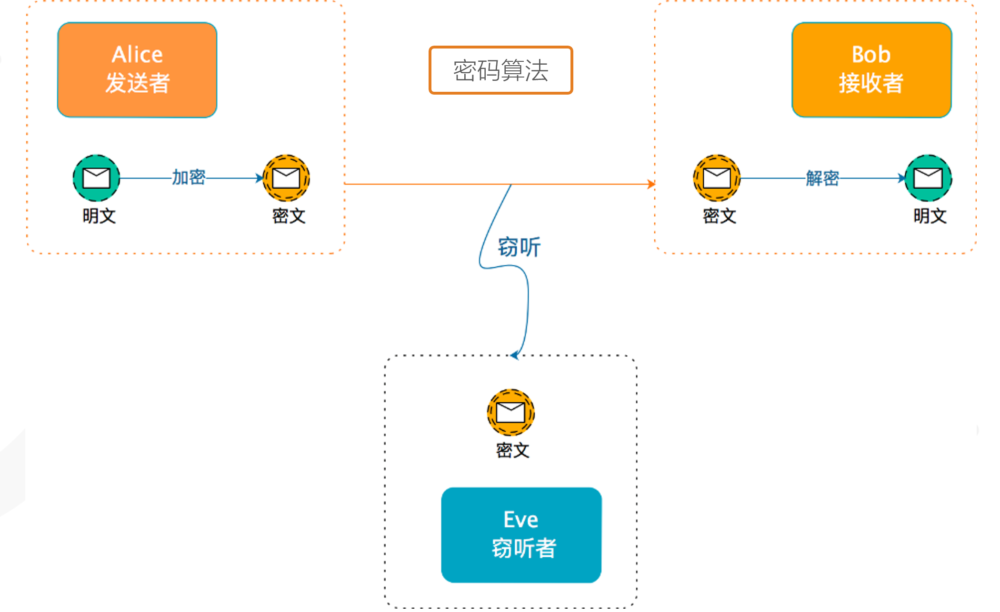

---
# 密码的分类：
对称密码：加密与解密使用**相同**秘钥的方式。

公钥密码：加密与解密使用**不同**秘钥的方式。

---
## 对称加密

---
### 对称加密中的密钥配置问题
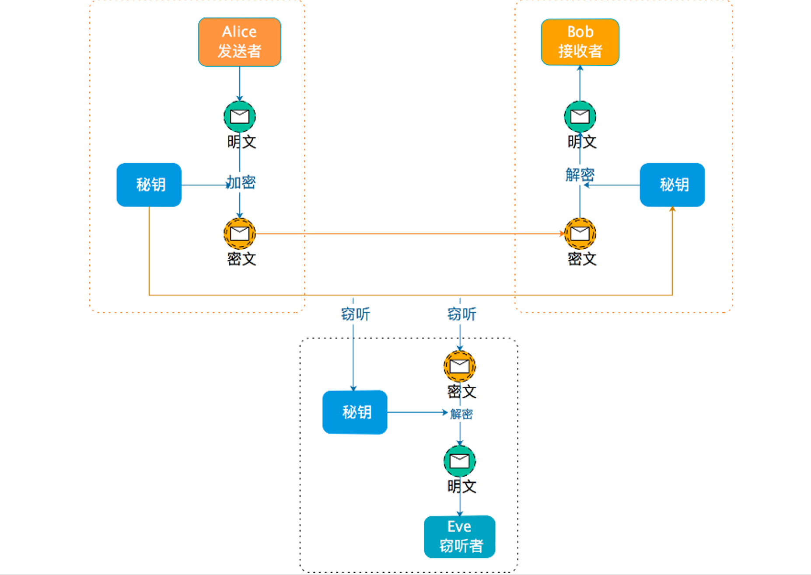

---
## 公钥加密(非对称加密)

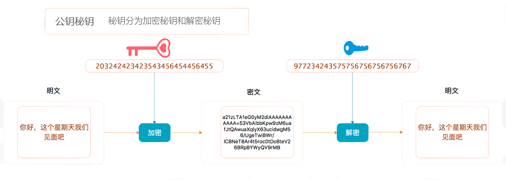

 **公钥加密、私钥解密** 

---
### 非对称加密的工作流程：
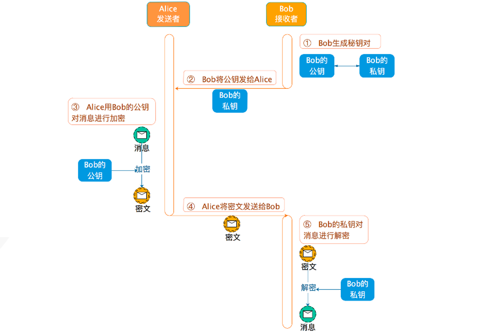

---
## 对称加密和非对称加密的比较
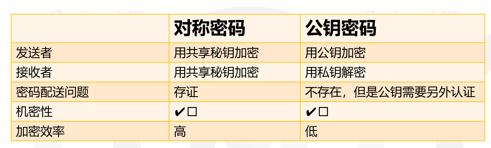

---
##混合密码系统
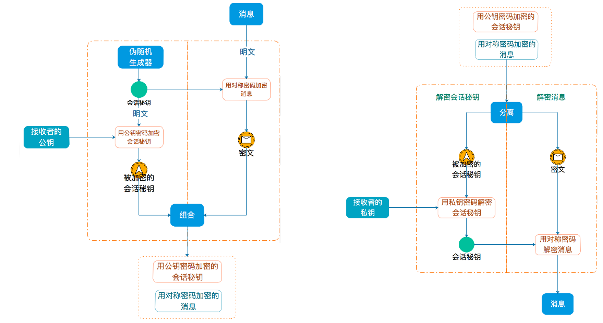

---
# 认证
## 认证的几种方式
- 单向散列函数：获取消息的指纹
- 消息认证码：消息被正确传送了吗？
- 数字签名：消息到底是谁写的？
- 证书：给公钥加上数字签名

---
## 认证 – 单向散列函数
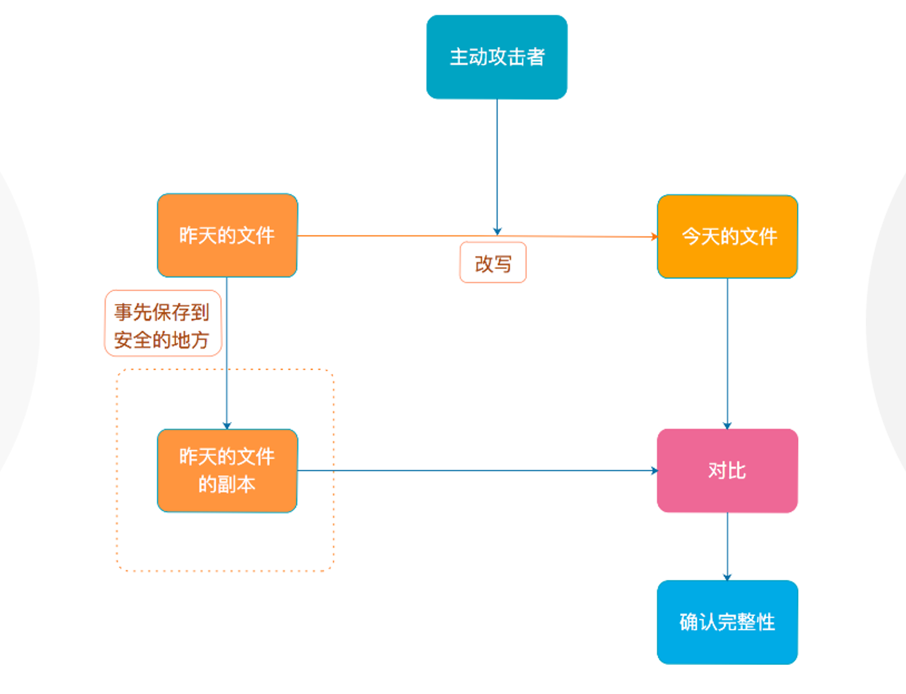

---
### 什么是单向散列函数
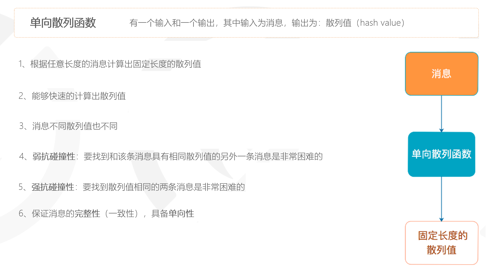

---
### 单向散列函数的应用实例
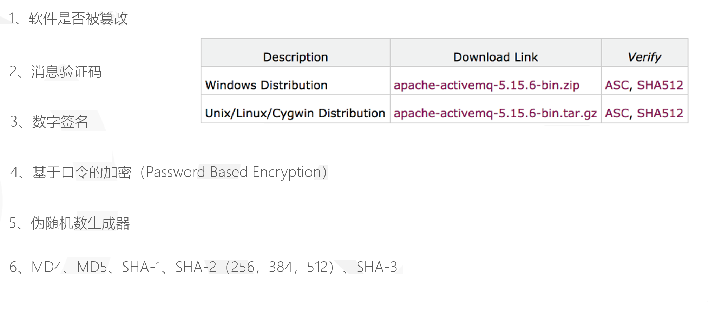

---
### 单向散列函数是如何确认数据的完整性的
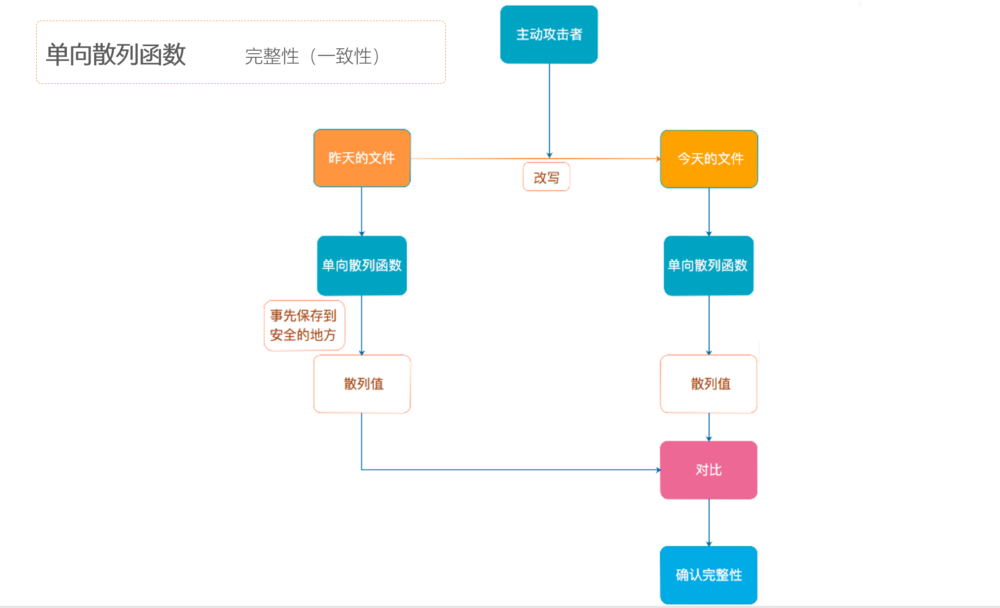

---
### 单向散列函数的局限性
- 能够辨别出篡改，但无法识别出伪装

---
## 认证 – 消息认证码
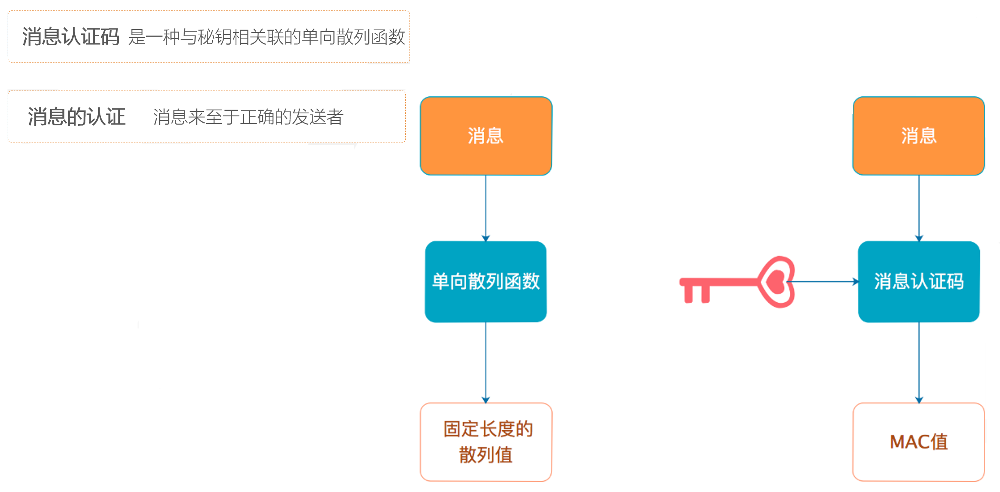

### 消息认证码使用
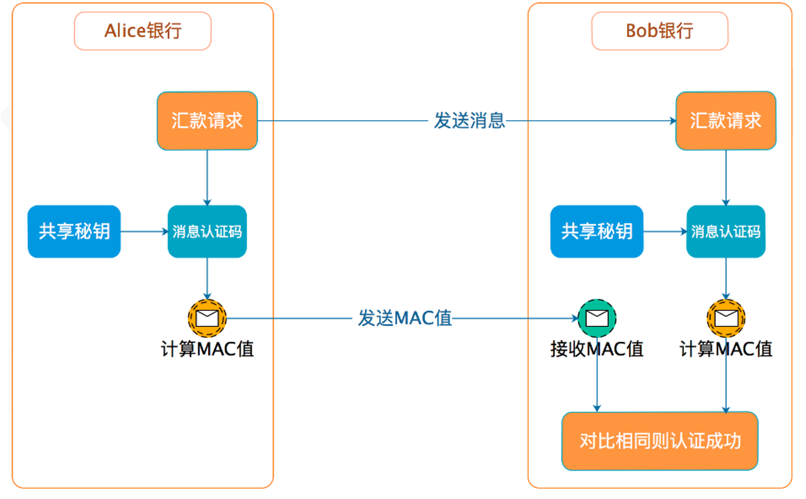

### 对消息认证码的攻击
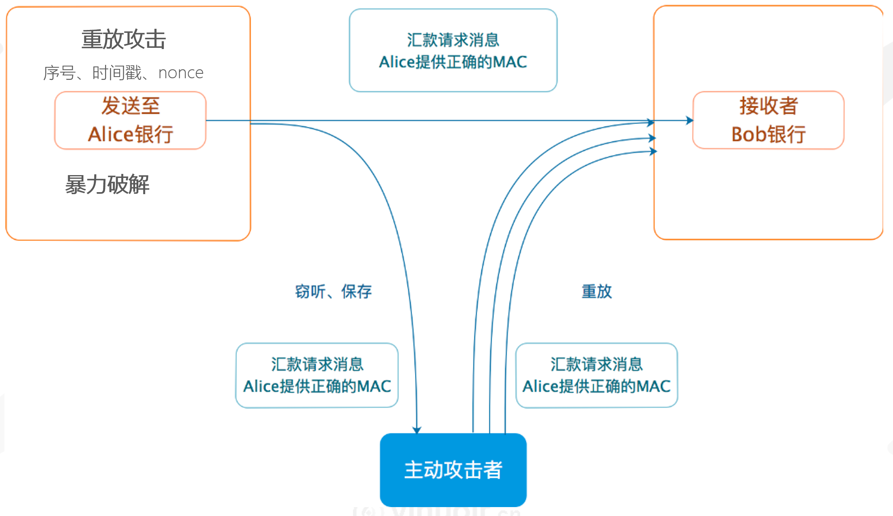

### 消息验证码应用案例
1、SWIFT（环球银行金融电信协会）
2、IP协议，对通信内容的认证和完整性校验
3、SSL/TLS

### 消息认证码无法解决的问题
1、第三方证明
2、防止否则

---
## 认证 – 数字签名

### 认证案例：
Alice的借条
- “Bob，我向你借款100万元。” – Alice
Alice写的邮件可以能被篡改，也可能是有人伪装成Alice或者Alice事成之后否认

数字签名。通过将公钥密码 “反过来用” 而实现的

### 私钥加密公钥验签
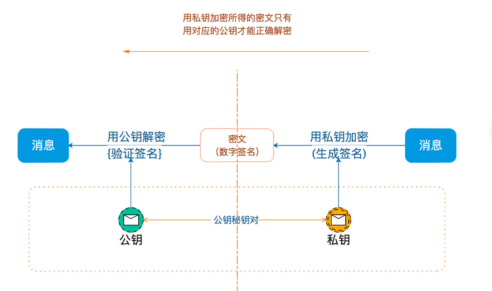

### 数字签名流程
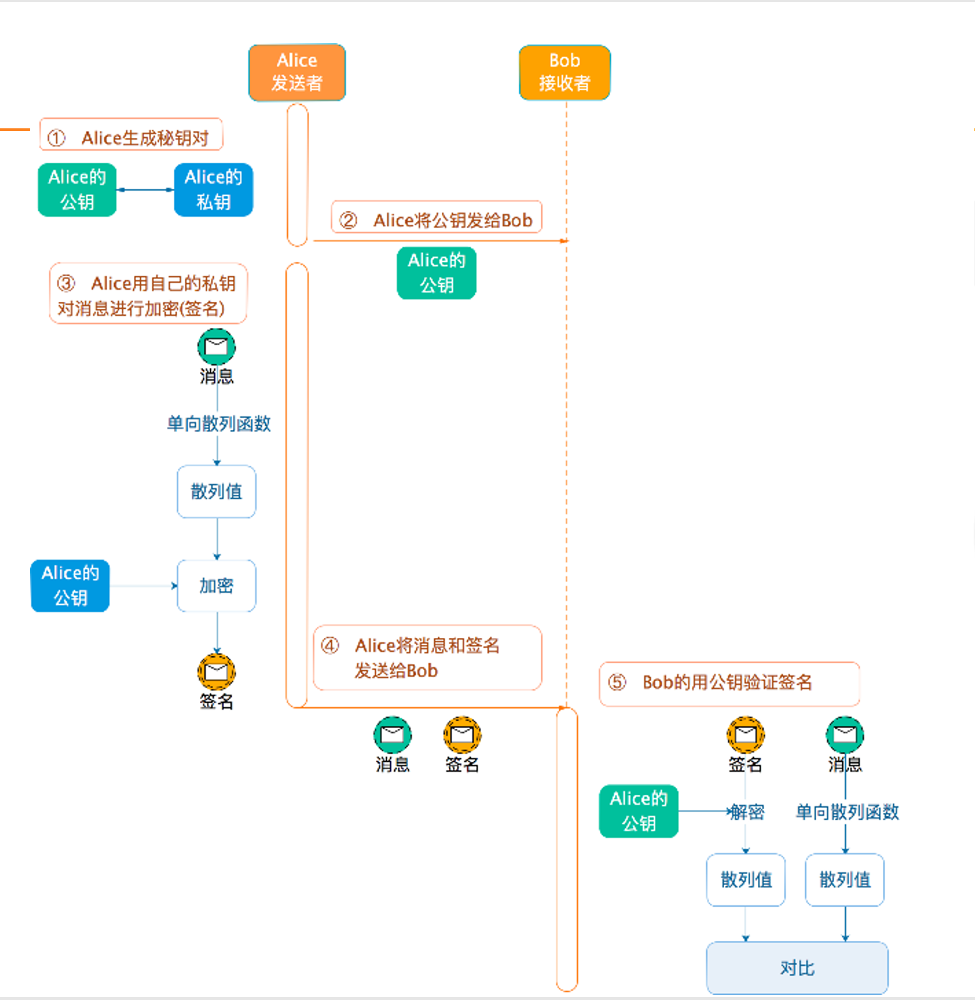

### 对数字签名的疑问
- 1、数字签名不能保证机密性吗？
    的确如此，数字签名的作用本来就不是保证机密性
- 2、这种签名可以随意复制吗？
    签名可以被复制，“是谁对这条消息进行了签名” 这一事实不会有任何改变
- 3、签名会不会被重复使用？
    签名可以被提取出来附加到别的消息后面，但是验证签名会失败
- 4、如何防止否认？
    防止否认与 “谁持有秘钥”、“我的私钥被别人窃取了” 也可能进行否认

### 数字签名应用实例
    1、安全信息公告
    2、公钥证书
    3、SSL/TLS

### 消息认证码VS数字签名
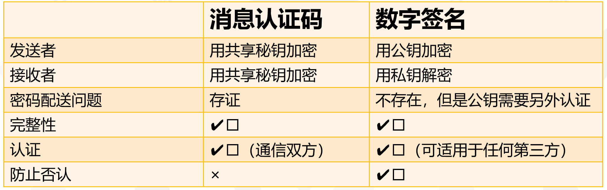

### 数字签名无法解决的问题
- 公钥必须属于真正的发送者
- 我们需要证书

# 证书
## 什么是证书？
**公钥证书也简称为证书(Certificate)。**公钥证书(Public Key Certificate)和驾照很相似，里面有姓名、组织、邮箱等信息，属于此人的公钥，并且有认证机构（CA）施加数字签名。只要看公钥证书，就可以知道认证机构认定该公钥的确属于此人。

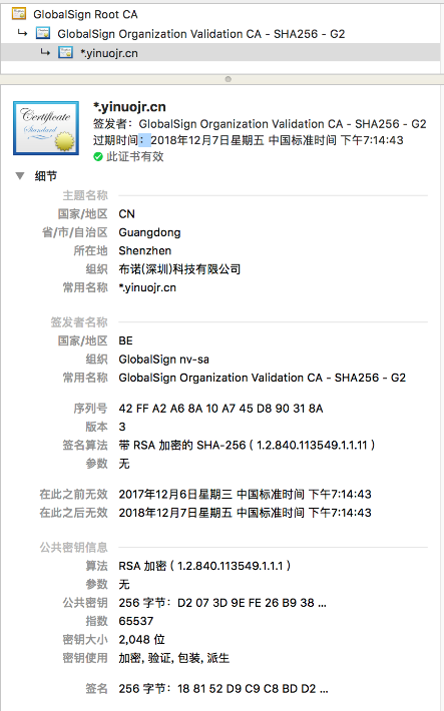

## 证书的应用场景
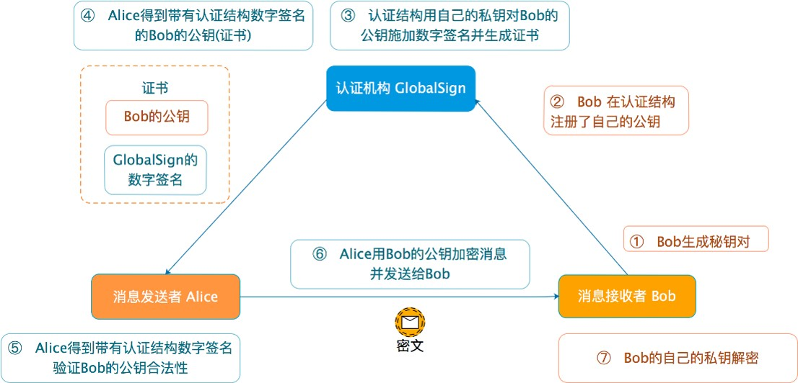

## 公钥基础设施(PKI)
Public-Key Infrastructure 是为了能够更有效地运转用公钥而制定的一系列规范和规格的总称
组成要素:
- 用户 – 使用PKI的人
- 认证机构（CA） – 颁发证书的人
- 仓库 – 保存证书的数据库

---
# PKI
**公钥基础设施（Public Key Infrastructure，简称PKI）** :
- 是为了能够更有效地运转用公钥而制定的一系列规范和规格的总称。
- 是目前网络安全建设的基础与核心，是电子商务安全实施的基本保障。
- 是一种遵循标准的利用公钥加密技术为电子商务的开展提供一套安全基础平台的技术和规范。

因此，对PKI技术的研究和开发成为目前信息安全领域的热点。

PKI 的核心组成部分CA( Certification Authority)，即认证中心，它是数字证书的签发机构。数字证书，有时被称为数字身份证，是一个符合一定格式的电子文件，用来识别电子证书持有者的真实身份。

---
# 背景
随着网络技术和信息技术的发展，电子商务已逐步被人们所接受，并在得到不断普及。

但由于各种原因，国内电子商务的安全性仍不能得到有效的保障！

在常规业务中，交易双方现场交易，可以确认购买双方的身份。利用商场开具的发票和客户现场支付商品费用，无须担心发生纠纷和无凭证可依。

但通过网上进行电子商务交易时，由于交易双方并不现场交易，因此，无法确认双方的合法身份，同时交易信息是交易双方的商业秘密，在网上传输时必须保证安全性，防止信息被窃取；**双方的交易非现场交易，一旦发生纠纷，必须能够提供仲裁。**

> **[info] 电子交易的互联网用户所面临的安全问题有:**
> - **保密性 ：**如何保证电子商务中涉及的大量保密信息在公开网络的传输过程中不被窃取；
> - **完整性 ：**如何保证电子商务中所传输的交易信息不被中途篡改及通过重复发送进行虚假交易；
> - **身份认证与授权 ：**在电子商务的交易过程中，如何对双方进行认证，以保证交易双方身份的正确性；
> - **抗抵赖 ：**在电子商务的交易完成后，如何保证交易的任何一方无法否认已发生的交易。

**这些安全问题将在很大程度上限制电子商务的进一步发展，因此如何保证Internet 网上信息传输的安全，已成为发展电子商务的重要环节。**

因此，在电子商务中，必须从技术上保证在交易过程中能够实现 **身份认证、安全传输、不可否认性、数据完整性**。

在采用数字证书认证体系之前，交易安全一直未能真 正得到解决。

为解决这些Internet 的安全问题，世界各国对其进行了多年的研究，初步形成了一套完整的Internet 安全解决方案：即目前被广泛采用的 **PKI 技术(Public Key Infrastructure-公钥基础设施)** 。

**PKI（公钥基础设施）技术**采用证书进行公钥管理，通过第三方的可信任机构-- **认证中心CA(Certificate Authority)**，把用户的公钥和用户的其他标识信息（如用户名称、e-mail、身份 证号等）捆绑在一起，在Internet 网上验证用户的身份。PKI把公钥密码和对称密码结合起来，在Internet网上实现密钥的自动管理，保证网上数据的安全传输。

目前，通用的办法是采用基于PKI结构结合数字证书，由于数字证书认证技术采用了加密传输和数字签名，通过把要传输的数字信息进行加密，保证信息传输的保密性、完整性，签名保证身份的真实性和抗抵赖。能够实现上述要求，因此在国内外电子商务中，都得到了广泛的应用。

因此，从大的方面来说，所有提供 **公钥加密** 和 **数字签名** 服务的系统，都可归结为PKI系统的一部分。
PKI的主要目的是：**通过自动管理密钥和证书，为用户建立起一个安全的网络运行环境，使用户可以在多种应用环境下方便的使用加密和数字签名技术，从而保证网上数据的机密性、完整性、有效性。**

> **[info] 注：数据的机密性是指：**
> - 数据在传输过程中，不能被非授权者偷看；
> - 数据的完整性是指数据在传输过程中不能被非法篡改；
> - 数据的有效性是指数据不能被否认。

---
#  PKI 的基本定义
- PKI 的基本定义十分简单，所谓PKI 就是一个用公钥概念、技术实施、提供安全服务的具有普适性的安全基础设施。

- PKI 是一种安全技术，它由公开密钥密码技术、数字证书、证书发放机构（CA）和关于公开密钥的安全策略等基本成分共同组成的。

- PKI 是利用公钥技术实现电子商务安全的一种体系，是一种基础设施，网络通讯、网上交易是利用它来保证安全的。

一个有效的PKI系统必须是 **安全的** 和 **透明的**，用户在获得加密和数字签名服务时，不需要详细地了解PKI的内部运作机制。从某种意义上讲，PKI 包含了**安全认证系统**：即安全认证系统-CA 系统是PKI 不可缺的组成部分。 

在一个典型、完整和有效的PKI系统中，除 **证书的创建和发布**，特别是 **证书的撤销** 之外，一个可用的PKI产品还必须提供相应的 **密钥管理服务**，包括密钥的备份、恢复和更新等。

**没有一个好的密钥管理系统，将极大影响一个PKI系统的规模、可伸缩性和在协同网络中的运行成本。**

在一个企业中，PKI系统必须有能力为一个用户管理多对密钥和证书；能够提供安全策略编辑和管理工具，如密钥周期和密钥用途等。

---
# PKI 的标准化问题：
PKI发展的一个重要方面就是标准化问题，它也是建立互操作性的基础。目前，PKI标准化主要有两个方面：

- RSA公司的公钥加密标准PKCS（Public Key Cryptography Standards）,它定义了许多基本PKI部件，包括数字签名和证书请求格式等；
- 由Internet工程任务组IETF（Internet Engineering Task Force）和PKI工作组PKIX（Public Key Infrastructure Working Group）所定义的一组具有互操作性的公钥基础设施协议。

在今后很长的一段时间内，PKCS和PKIX将会并存，大部分的PKI产品为保持兼容性，也将会对这两种标准进行支持。

---
#  PKI 的组成
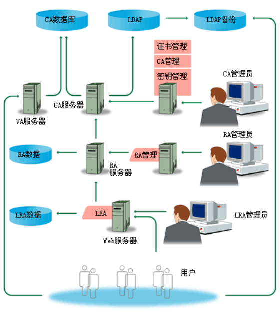
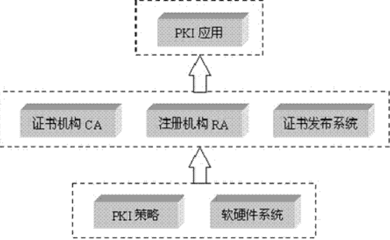

一个典型的PKI系统如图所示，包括 **PKI策略、软硬件系统、证书机构CA、注册机构RA、证书发布系统和PKI应用** 等。

---
## PKI安全策略 
- PKI安全策略建立和定义了一个组织信息安全方面的指导方针，同时也定义了密码系统使用的处理方法和原则。它包括一个组织怎样处理密钥和有价值的信息，根据风险的级别定义安全控制的级别。一般情况下，在PKI中有两种类型的策略：
  
- **一是证书策略：**，用于管理证书的使用，比如，可以确认某一CA是在Internet上的公有CA，还是某一企业内部的私有CA；

- **另外一个就是CPS**(Certificate Practice Statement):一些由商业证书发放机构（CCA）或者可信的第三方操作的PKI系统需要CPS。这是一个包含如何在实践中增强和支持安全策略的一些操作过程的详细文档。它包括**CA是如何建立和运作的**，**证书是如何发行**、**接收**和**废除**的，**密钥是如何产生**、**注册**的，以及**密钥是如何存储的**，**用户是如何得到它的**等等。 

---
## CA(Certification Authority --证书认证中心)

证书机构CA是PKI的信任基础，它管理公钥的整个生命周期，其作用包括：
- 发放证书
- 规定证书的有效期
- 通过发布证书废除列表（CRL）确保必要时可以废除证书。

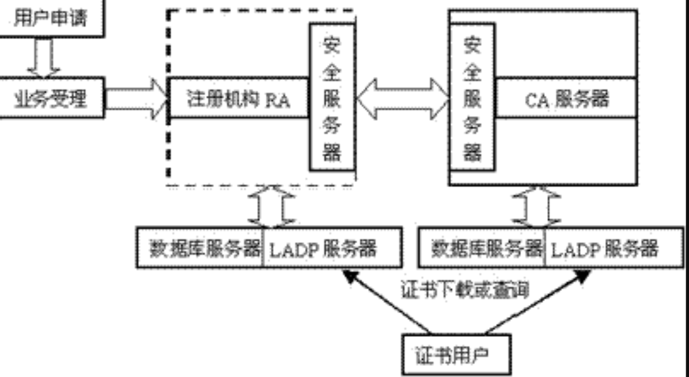

证书机构CA用于创建和发布证书，它通常为一个称为安全域（security domain）的有限群体发放证书。
- 创建证书的时候，CA系统首先获取用户的请求信息，其中包括用户公钥（如果用户端是个人使用或者测试用，则公钥一般由用户端产生，如电子邮件程序或浏览器等或者使用第三方开发的具有独立CSP的智能终端如USBkey），CA将根据用户的请求信息产生证书，并用自己的私钥对证书进行签名。
- 其他用户、应用程序或实体将使用CA的公钥对证书进行验证。如果一个CA系统是可信的，则验证证书的用户可以确信，他所验证的证书中的公钥属于证书所代表的那个实体。

CA还负责维护和发布证书废除列表CRL（certificate revocation lists，又称为证书黑名单）。
当一个证书，特别是其中的公钥因为其他原因无效时（不是因为到期），CRL提供了一种通知用户和其他应用的中心管理方式。CA系统生成CRL以后，要么是放到LDAP服务器中供用户查询或下载，要么是放置在Web服务器的合适位置，以页面超级连接的方式供用户直接查询或下载。

---
## RA(Registration Authority --注册审批机构)
- 注册机构RA提供用户和CA之间的一个接口，它获取并认证用户的身份，向CA提出证书请求。它主要完成收集用户信息和确认用户身份的功能。
- 这里指的用户，是指将要向认证中心（即CA）申请数字证书的客户，可以是个人，也可以是集团或团体、某政府机构等。注册管理一般由一个独立的注册机构（即RA）来承担。它接受用户的注册申请，审查用户的申请资格，并决定是否同意CA给其签发数字证书。
- 注册机构并不给用户签发证书，而只是对用户进行资格审查。因此，RA可以设置在直接面对客户的业务部门，如银行的营业部、机构认识部门等。当然，对于一个规模较小的PKI应用系统来说，可把注册管理的职能由认证中心CA来完成，而不设立独立运行的RA。但这并不是取消了PKI的注册功能，而只是将其作为CA的一项功能而已。
- PKI国际标准推荐由一个独立的RA来完成注册管理的任务，可以增强应用系统的安全。 

---
## 证书发布系统
证书发布系统负责证书的发放，如可以通过用户自己，或是通过目录服务。目录服务器可以是一个组织中现存的，也可以是PKI方案中提供的。 

PKI的应用非常广泛，包括在web服务器和浏览器之间的通讯、电子邮件、电子数据交换（EDI）、在Internet上的信用卡交易和虚拟私有网（VPN）等。

一个简单的PKI系统包括 **证书机构CA**、**注册机构RA**和**相应的PKI存储库**。
- CA用于签发并管理证书；
- RA可作为CA的一部分，也可以独立，其功能包括个人身份审核、CRL管理、密钥产生和密钥对备份等；
- PKI存储库包括LDAP目录服务器和普通数据库，用于对用户申请、证书、密钥、CRL和日志等信息进行存储和管理，并提供一定的查询功能。

### CA是证书的签发机构,它是PKI的核心。
- CA是负责签发证书、认证证书、管理已颁发证书的机关。它要制定政策和具体步骤来验证、识别用户身份，并对用户证书进行签名，以确保证书持有者的身份和公钥的拥有权。。 

- CA 也拥有一个证书（内含公钥）和私钥。网上的公众用户通过验证 CA 的签字从而信任 CA ，任何人都可以得到 CA 的证书（含公钥），用以验证它所签发的证书。 

如果用户想得到一份属于自己的证书，他应先向 CA 提出申请。在 CA 判明申请者的身份后，便为他分配一个公钥，并且 CA 将该公钥与申请者的身份信息绑在一起，并为之签字后，便形成证书发给申请者。 

如果一个用户想鉴别另一个证书的真伪，他就用 CA 的公钥对那个证书上的签字进行验证，一旦验证通过，该证书就被认为是有效的。 

证书 
　　证书实际是由证书签证机关（CA）签发的对用户的公钥的认证。 
　　证书的内容包括：电子签证机关的信息、公钥用户信息、公钥、权威机构的签字和有效期等等。目前，证书的格式和验证方法普遍遵循X.509 国际标准。 
　　加密： 　 
　  我们将文字转换成不能直接阅读的形式（即密文）的过程称为加密。 
　　解密： 　　 
    我们将密文转换成能够直接阅读的文字（即明文）的过程称为解密。 

　　如何在电子文档上实现签名的目的呢？我们可以使用数字签名。RSA公钥体制可实现对数字信息的数字签名，方法如下： 
　　信息发送者用其私钥对从所传报文中提取出的特征数据（或称数字指纹）进行RSA算法操作，以保证发信人无法抵赖曾发过该信息（即不可抵赖性），同时也确保信息报文在传递过程中未被篡改（即完整性）。当信息接收者收到报文后，就可以用发送者的公钥对数字签名进行验证。 
  数字证书： 
　　答: 数字证书为实现双方安全通信提供了电子认证。在因特网、公司内部网或外部网中，使用数字证书实现身份识别和电子信息加密。数字证书中含有密钥对（公钥和私钥）所有者的识别信息，通过验证识别信息的真伪实现对证书持有者身份的认证。 
　　 
  使用数字证书能做什么? 　 
　数字证书在用户公钥后附加了用户信息及CA的签名。公钥是密钥对的一部分，另一部分是私钥。公钥公之于众，谁都可以使用。私钥只有自己知道。由公钥加密的信息只能由与之相对应的私钥解密。为确保只有某个人才能阅读自己的信件，发送者要用收件人的公钥加密信件；收件人便可用自己的私钥解密信件。同样，为证实发件人的身份，发送者要用自己的私钥对信件进行签名；收件人可使用发送者的公钥对签名进行验证，以确认发送者的身份。 
　　在线交易中您可使用数字证书验证对方身份。用数字证书加密信息，可以确保只有接收者才能解密、阅读原文，信息在传递过程中的保密性和完整性。有了数字证书网上安全才得以实现，电子邮件、在线交易和信用卡购物的安全才能得到保证。 

2、CA的架构 
   CA认证的主要工具是CA中心为网上作业主体颁发的数字证书。CA架构包括PKI结构、高强度抗攻击的公开加解密算法、数字签名技术、身份认证技术、运行安全管理技术、可靠的信任责任体系等等。 
   公钥加密的信息必须由对应的私钥才能解密，同样，私钥做出的签名，也只有配对的公钥才能解密。公钥有时用来传输对称密钥，这就是数字信封技术。密钥的管理政策是把公钥和实体绑定，由CA中心把实体的信息和实体的公钥制作成数字证书，证书的尾部必须有CA中心的数字签名。 
   由于CA中心的数字签名是不可伪造的，因此实体的数字证书不可伪造。CA中心对实体的物理身份资格审查通过后，才对申请者颁发数字证书，将实体的身份与数字证书对应起来。由于实体都信任提供第三方服务的CA中心，因此，实体可以信任由CA中心颁发数字证书的其他实体，放心地在网上进行作业和交易。 

工作原理： 
   现在假设客户A向银行B传送数字信息，为了保证信息传送的真实性、完整性和不可否认性，需要对要传送的信息进行数字加密和数字签名，其传送过程如下： 

　　（1）客户A准备好要传送的数字信息（明文）。（准备明文） 

　　（2）客户A对数字信息进行哈希（hash）运算，得到一个信息摘要。（准备摘要） 

　　3）客户A用自己的私钥（SK）对信息摘要进行加密得到客户A的数字签名，并将其附在数字信息上。　（用私钥对数字信息进行数字签名）　 

　　4）客户A随机产生一个加密密钥（DES密钥），并用此密钥对要发送的信息进行加密，形成密文。 （生成密文） 

　　5）客户A用双方共有的公钥（PK）对刚才随机产生的加密密钥进行加密，将加密后的DES密钥连同密文一起传送给乙。（用公钥对DES密钥进行加密）　　 

　　6）银行B收到客户A传送过来的密文和加过密的DES密钥，先用自己的私钥（SK）对加密的DES密钥进行解密，得到DES密钥。（用私钥对DES密钥解密）　　 

　　7）银行B然后用DES密钥对收到的密文进行解密，得到明文的数字信息，然后将DES密钥抛弃（即DES密钥作废）。（解密文）　　 

　　8）银行B用双方共有的公钥（PK）对客户A的数字签名进行解密，得到信息摘要。银行B用相同的hash算法对收到的明文再进行一次hash运算，得到一个新的信息摘要。　　 
（用公钥解密数字签名） 
　　9）银行B将收到的信息摘要和新产生的信息摘要进行比较，如果一致，说明收到的信息没有被修改过。（对比信息摘要和信息） 

- PKI安全策略建立和定义了一个组织信息安全方面的指导方针，同时也定义了密码系统使用的处理方法和原则。它包括一个组织怎样处理密钥和有价值的信息，根据风险的级别定义安全控制的级别。一般情况下，在PKI中有两种类型的策略：一是证书策略，用于管理证书的使用。

比如，可以确认某一CA是在Internet上的公有CA，还是某一企业内部的私有CA；另外一个就是CPS（Certificate Practice Statement）。一些由商业证书发放机构（CCA）或者可信的第三方操作的PKI系统需要CPS。这是一个包含如何在实践中增强和支持安全策略的一些操作过程的详细文档。它包括CA是如何建立和运作的，证书是如何发行、接收和废除的，密钥是如何产生、注册的，以及密钥是如何存储的，用户是如何得到它的等等。 

1. 证书机构CA是PKI的信任基础，它管理公钥的整个生命周期，其作用包括：发放证书、规定证书的有效期和通过发布证书废除列表（CRL）确保必要时可以废除证书。后面将会在CA进行详细介绍。 

2. 注册机构RA提供用户和CA之间的一个接口，它获取并认证用户的身份，向CA提出证书请求。它主要完成收集用户信息和确认用户身份的功能。这里指的用户，是指将要向认证中心（即CA）申请数字证书的客户，可以是个人，也可以是集团或团体、某政府机构等。注册管理一般由一个独立的注册机构（即RA）来承担。它接受用户的注册申请，审查用户的申请资格，并决定是否同意CA给其签发数字证书。注册机构并不给用户签发证书，而只是对用户进行资格审查。因此，RA可以设置在直接面对客户的业务部门，如银行的营业部、机构认识部门等。当然，对于一个规模较小的PKI应用系统来说，可把注册管理的职能由认证中心CA来完成，而不设立独立运行的RA。但这并不是取消了PKI的注册功能，而只是将其作为CA的一项功能而已。PKI国际标准推荐由一个独立的RA来完成注册管理的任务，可以增强应用系统的安全。 

3. 证书发布系统负责证书的发放，如可以通过用户自己，或是通过目录服务。目录服务器可以是一个组织中现存的，也可以是PKI方案中提供的。 

PKI的应用非常广泛，包括在web服务器和浏览器之间的通讯、电子邮件、电子数据交换（EDI）、在Internet上的信用卡交易和虚拟私有网（VPN）等。 

 

一个简单的PKI系统包括证书机构CA、注册机构RA和相应的PKI存储库。CA用于签发并管理证书；RA可作为CA的一部分，也可以独立，其功能包括个人身份审核、CRL管理、密钥产生和密钥对备份等；PKI存储库包括LDAP目录服务器和普通数据库，用于对用户申请、证书、密钥、CRL和日志等信息进行存储和管理，并提供一定的查询功能。