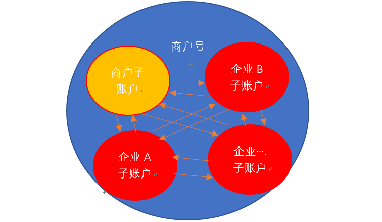

# 华夏银行账户体系

# 华夏账户结构

## 商户号
### 商户号怎么来的？
经营主体为了对接银行的资金存管系统，向对应银行发起对接系统申请，由总行分配一个系统对接准入号（标识号），银行内部一个号对应一个商户。（第三方支付 接口接入 比如微信 appId 等）。

### 商户号的理解
商户的名称（用编号进行名称对应）

唐伯虎 --------》9527
布诺（深圳）科技有限公司 --------》11111133

### 商户号包含什么
 

- 商户基本信息
- 商户回调地址
- 企业法人信息
- 手续费配置信息
- 商户子账户
- 商户结算户信息 （出金---默认绑定一张本行结算户（企业结算户分类 参考人民币结算户））
- 隐藏信息  ----- 资金存管账户信息，收益账户等

## 子账户
### 子账户怎么来的？

企业通过商户对接网银行资金存管系统后，在商户的平台（yinuojr）调用子账户开户接口------生成对应企业在商户下的虚拟交易账户。

### 申请流程

## 商户号与商户下子账户关系

## 资金存管账户

### 什么是资金存管账户--【电子商务受托监管账户】
独立于人民银行系统外的账户，可以理解为银行内部为了监管企业资金设定的特殊账户。

### 为什么使用资金存管账户
防止商户卷钱跑路。。。。。采用的手段就是**限制出金**

## 虚拟账户 ---- 结算户资金流向图

## 华夏银行-资金存管系统资金存管账户变更
### 起因：

###分析
- 电子商务受托监管账户（存管账户）

独立于人民银行账户体系外的账户，可以理解为银行内部为了监管企业资金特殊账户（银行自己监控的账户）

- 单位人民币专用账户（补充知识点拓展）-人民银行结算户，可以进行司法介入。

### 结论
重新去（商户号）对应银行支行开一个符合监管要求的账户，性质为**单位人民币专用存款账户**，由华夏内部进行原存管账户转账到新开的单位人民币专用存管账户内。

【切换账户过程1.告知预切换账号时间 ，2 切换账号需要柜台进行账户转账，网络金融部门进行账户切换】