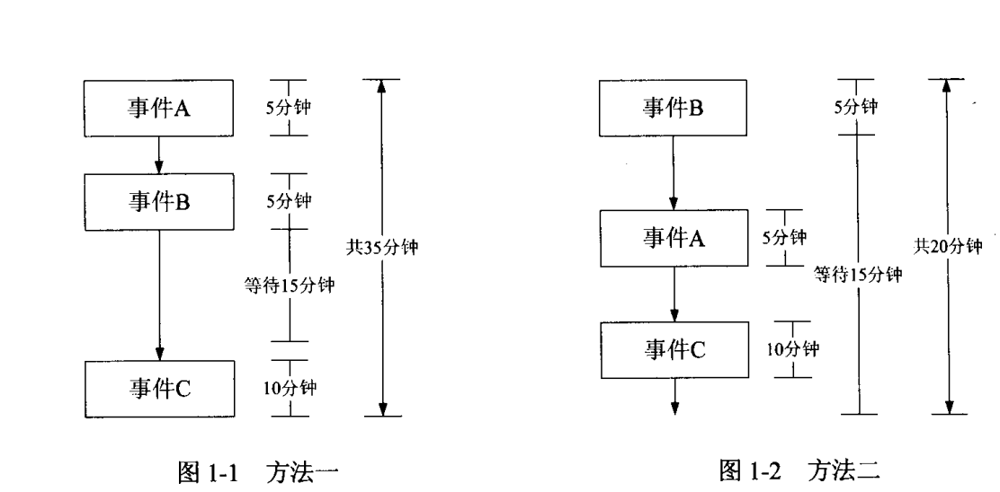

# 第一章 算法概述.md

## 1.1 什么是算法
- 用于计算的方法。
- 是解决实际问题的一种精确描述方法
- 是对特定问题求解步骤的一种精确描述方法
- 是模型分析的一组可行的、确定和又穷的规则

**通俗来说：**
- 算法可以理解为一个完整的解题步骤，由一些基本运算规则和运算顺序而构成。通过这样的解题步骤可以解决特定的问题。
- 一系列求解问题的指令构成，能够规范输入输出，在有限的时间内获得有效的输出。
- 算法代表了用系统的方法来描述解决问题的一种策略机制。

## 算法的几个特征：
- 又穷性
- 确切性
- 输入
- 输出
- 可行性

## 算法的性能评估
### 时间复杂度：
时间复杂度也就是通常所说的算法执行所需要耗费的时间，时间越短，算法越好。

一个算法执行的时间往往无法精确估计，通常需要在实际的计算机中运行才能够知道。但是，我们也可以对算法代码进行估计，而得到算法的时间复杂度。

### 空间复杂度：
空间复杂度指的是算法程序在计算机中执行所需要消耗的存储空间。

**空间复杂度其实可以分为 如下两个方面：**
- 程序保存所需要的存储空间，也就是程序的大小。
- 程序在执行过程中所需要消耗的存储空间资源，例如程序在执行过程中的中间变量等。 

一般来说，程序的大小越小，执行过程中消耗的资源越少，这个程序越好。在算法分析中 ，空间复杂度有更为详细的度量。

