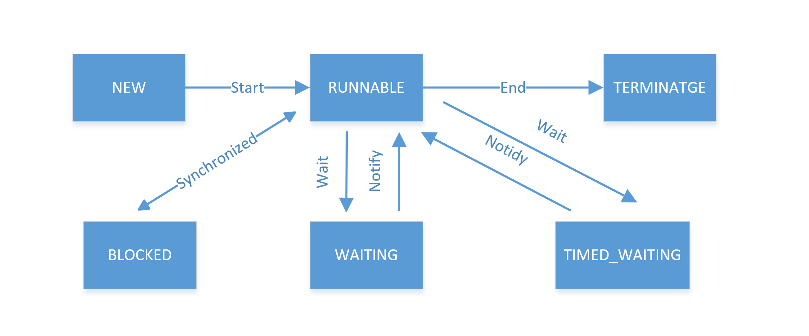

# 第2章　Java并行程序基础	29
## 2.1　有关线程你必须知道的事	29
> **[info] 进程(Process):**
- 进程是一个容器。<font color="red">进程是线程的容器</font>

---
> **[info] 进程和线程的关系:**
- 线程就是轻量级进程，是程序执行的最小单位。
- 使用多线程而不是用多进程去进行并发程序的设计，是因为线程间的切换和调度的成本远远小于进程。

---
> **[info] 线程状态:**

  

```java
public enum State{
NEW,
RUNNABLE,
BLOCKED,
WAITING,
TIMED_WAITING,
TERMINATED
}
```
> **[warning] 注意**
- 从NEW状态出发后，线程不能再回到NEW状态。
- 处于TERMINATED的线程也不能再回到 RUNNABLE 状态。

## 2.2　初始线程：线程的基本操作	32
    
### 2.2.1　新建线程	32

> **[info] 继承Thread类、实现Runnable接口:**
- Thread类和Runnable类，Thread中的构造方法`public Thread(Runnable target)`，其中run函数如下：

```java
public void run(){
    if(target != null){
        target.run();
    }
}
```
> **[warning] 注意**
- 不要用run()来开启新线程。它只会在当前线程中,串行执行run()中的代码。

### 2.2.2　终止线程	34

- 终止线程的stop方法不建议使用，可能会导致数据不一致，可以使用内部设置函数来解决问题

### 2.2.3　线程中断	38

```java
public void Thread.interrupt() //中断线程
public boolean Thread.isInterrupted() //判断线程是否中断
public static boolean Thread.interrupted() //判断是否中断，并清除中断状态
```

在sleep时，如果来临中断，会进入中断异常，同时也会将标记位清空，所以异常处理那里经常要再次中断自己

### 2.2.4　等待（wait）和通知（notify）	41

- wait会释放掉锁
- [SimpleWN](https://github.com/guanpengchn/java-concurrent-programming/blob/master/src/main/java/ch2/SimpleWN.java)

### 2.2.5　挂起（suspend）和继续执行（resume）线程	44

- suspend和resume不推荐使用，因为不会释放锁资源，查看jstack时可以使用jps查看pid
- [BadSuspend](https://github.com/guanpengchn/java-concurrent-programming/blob/master/src/main/java/ch2/BadSuspend.java)

### 2.2.6　等待线程结束（join）和谦让（yield）	48

- [JoinMain](https://github.com/guanpengchn/java-concurrent-programming/blob/master/src/main/java/ch2/JoinMain.java)
     
## 2.3　volatile与Java内存模型（JMM）	50

- volatile无法保证原子性
- [NoVisibility](https://github.com/guanpengchn/java-concurrent-programming/blob/master/src/main/java/ch2/NoVisibility.java)

## 2.4　分门别类的管理：线程组	52

- [ThreadGroupName](https://github.com/guanpengchn/java-concurrent-programming/blob/master/src/main/java/ch2/ThreadGroupName.java)

## 2.5　驻守后台：守护线程（Daemon）	54

- [DaemonDemo](https://github.com/guanpengchn/java-concurrent-programming/blob/master/src/main/java/ch2/DaemonDemo.java)

## 2.6　先干重要的事：线程优先级	55

- [PriorityDemo](https://github.com/guanpengchn/java-concurrent-programming/blob/master/src/main/java/ch2/PriorityDemo.java)

## 2.7　线程安全的概念与synchronized	57

- [AccountingVol](https://github.com/guanpengchn/java-concurrent-programming/blob/master/src/main/java/ch2/AccountingVol.java)
- [AccountingSyncBad](https://github.com/guanpengchn/java-concurrent-programming/blob/master/src/main/java/ch2/AccountingSyncBad.java)

## 2.8　程序中的幽灵：隐蔽的错误	61
    
### 2.8.1　无提示的错误案例	61
### 2.8.2　并发下的ArrayList	62
### 2.8.3　并发下诡异的HashMap	63
### 2.8.4　初学者常见问题：错误的加锁	66
        
## 2.9　参考文献	68