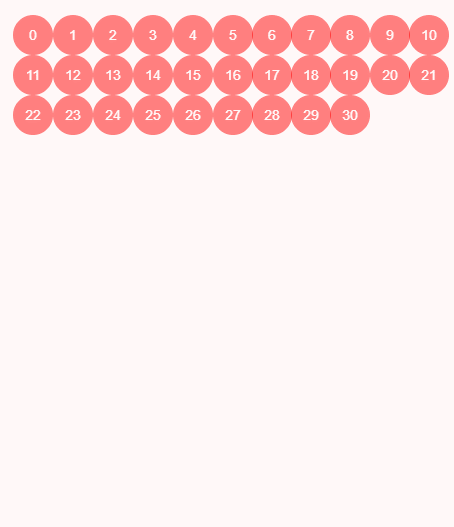

# 
# 为什么要学习数据结构
- 数据结构是所有计算机专业同学必修的课程。
- 数据结构研究是数据如何在计算机中进行组织和存储，使得我们可以高效的获取数据或修改数据。

# 数据结构的分类：
## 线性结构
- **数组**
- **栈**
- **队列**
- **链表**
- **哈希表**

## 树结构：
- 二叉树
- **二分搜索树**
- Treap
- Splay
- **堆**
- **Trie**
- **线段树**
- **并查集**
- **AVL**
- **红黑树**
- K-D树
- 哈夫曼树

## 图结构：
- 领接矩阵
- 领接表

## 在计算机的世界里，数据结构无处不在
- 数据库
### 树结构
- AVL
- 红黑树
- Treap
- 伸展度
- B数
- 哈希表

### 数据结构 + 算法 = 程序

## 学习数据结构有什么作用

## 算法和数据结构的区别

[可视化不平衡二分搜索树_静态](./html/可视化不平衡二分搜索树/index.html)
[可视化不平衡二分搜索树_动态](./html/可视化不平衡二分搜索树/indexAnimate.html)
[可视化二叉树](./html/可视化二叉树/index.html)

