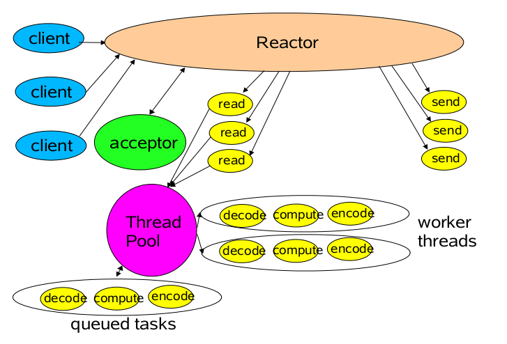

# 标题标题
> 在线文档：https://www.appinn.com/markdown/

md语法学习：

1：斜体文字===>
    *Markdown是一种轻量级的「标记语言」*
    _Markdown是一种轻量级的「标记语言」_
    
---
2：粗体文字===>
    **Markdown是一种轻量级的「标记语言」**
     __Markdown是一种轻量级的「标记语言」__

---
3：粗体加斜体文字===>
    ***Markdown是一种轻量级的「标记语言」***
    ___Markdown是一种轻量级的「标记语言」___

---
4：锚点和超链接===>
[普通链接](http://www.baidu.com/)
[普通链接带标题](http://www.baidu.com/ "普通链接带标题")
__直接链接：__<http://www.mdeditor.com>
[锚点链接][anchor-id]
[anchor-id]: http://www.sina.com/


5：显示图片超链接的图片：===>
    
    
---
6：标题：
# 标题H1
## 标题H2
### 标题H3
#### 标题H4
##### 标题H5
###### 标题H5

---
7:分割线===> 

---
8:删除线===>
    ~~删除线~~ 
    <s>删除线（开启识别HTML标签时）</s>

---
9:上标和下标===>
    上标：X<sub>2</sub>，下标：O<sup>2</sup>
    
---
10:内嵌===>
> 即更长的单词或短语的缩写形式，前提是开启识别HTML标签时，已默认开启
>> 即更长的单词或短语的缩写形式，`前提是开启识别HTML标签时`，已默认开启
>>>> 即更长的单词或短语的缩写形式，前提是开启识别HTML标签时，已默认开启

---
11：换行===>
<br/>

---
12：执行命令===>

执行命令：`npm install marked`

---
13:缩进风格===>

即缩进四个空格，也做为实现类似 `<pre>` 预格式化文本 ( Preformatted Text ) 的功能。

    <php
        echo "Hello world!";
    >
    
    ---
14:预格式化文本===>

    | First Header  | Second Header |
    | ------------- | ------------- |
    | Content Cell  | Content Cell  |
    | Content Cell  | Content Cell  |

---
15：JS代码===>
```javascript
function test() {
	console.log("Hello world!");
}
```

---
16: HTML 代码 HTML codes===>
```html
<!DOCTYPE html>
<html>
    <head>
        <mate charest="utf-8" />
        <meta name="keywords" content="Editor.md, Markdown, Editor" />
        <title>Hello world!</title>
        <style type="text/css">
            body{font-size:14px;color:#444;font-family: "Microsoft Yahei", Tahoma, "Hiragino Sans GB", Arial;background:#fff;}
            ul{list-style: none;}
            img{border:none;vertical-align: middle;}
        </style>
    </head>
    <body>
        <h1 class="text-xxl">Hello world!</h1>
        <p class="text-green">Plain text</p>
    </body>
</html>
```

---
17:列表===>

#### 无序列表（减号）Unordered Lists (-)
- 列表一
- 列表二
- 列表三

#### 无序列表（星号）Unordered Lists (*)
* 列表一
* 列表二
* 列表三

#### 无序列表（加号和嵌套）Unordered Lists (+)
+ 列表一
+ 列表二
    + 列表二-1
    + 列表二-2
    + 列表二-3
+ 列表三
    * 列表一
    * 列表二
    * 列表三

#### 有序列表 Ordered Lists (-)
1. 第一行
2. 第二行
3. 第三行

#### GFM task list
- [x] GFM task list 1
- [x] GFM task list 2
- [ ] GFM task list 3
    - [ ] GFM task list 3-1
    - [ ] GFM task list 3-2
    - [ ] GFM task list 3-3
- [ ] GFM task list 4
    - [ ] GFM task list 4-1
    - [ ] GFM task list 4-2

---
18:绘制表格===>
| 项目        | 价格   |  数量  |
| --------   | -----:  | :----:  |
| 计算机      | 1600   |   5     |
| 手机        |   12   |   12   |
| 管线        |    1    |  234  |

First Header  | Second Header
------------- | -------------
Content Cell  | Content Cell
Content Cell  | Content Cell

| First Header  | Second Header |
| ------------- | ------------- |
| Content Cell  | Content Cell  |
| Content Cell  | Content Cell  |

| Function name | Description                    |
| ------------- | ------------------------------ |
| `help()`      | Display the help window.       |
| `destroy()`   | **Destroy your computer!**     |

| Left-Aligned  | Center Aligned  | Right Aligned |
| :------------ |:---------------:| -----:|
| col 3 is      | some wordy text | $1600 |
| col 2 is      | centered        |   $12 |
| zebra stripes | are neat        |    $1 |

| Item      | Value |
| --------- | -----:|
| Computer  | 1600 |
| Phone     |   12 |
| Pipe      |    1 |


---
19:特殊符号===>
&copy;
&  
&uml; 
&trade; 
&iexcl; 
&pound;
&amp; 
&lt; 
&gt; 
&yen; 
&euro; 
&reg; 
&plusmn; 
&para; 
&sect; 
&brvbar; 
&macr; 
&laquo; 
&middot;

X&sup2; 
Y&sup3; 
&frac34; 
&frac14;  
&times;  
&divide;   
&raquo;

18&ordm;
C  
&quot;
&apos;

---
20:科学公式===>

$$
E=mc^2
$$

行内的公式：$$E=mc^2$$行内的公式，行内的$$E=mc^2$$公式。

$$
x > y
$$

$$
\(\sqrt{3x-1}+(1+x)^2\)
$$

$$
\sin(\alpha)^{\theta}=\sum_{i=0}^{n}(x^i + \cos(f))
$$

多行公式：
$$
\displaystyle
\left( \sum\_{k=1}^n a\_k b\_k \right)^2
\leq
\left( \sum\_{k=1}^n a\_k^2 \right)
\left( \sum\_{k=1}^n b\_k^2 \right)
$$

$$
\displaystyle
    \frac{1}{
        \Bigl(\sqrt{\phi \sqrt{5}}-\phi\Bigr) e^{
        \frac25 \pi}} = 1+\frac{e^{-2\pi}} {1+\frac{e^{-4\pi}} {
        1+\frac{e^{-6\pi}}
        {1+\frac{e^{-8\pi}}
         {1+\cdots} }
        }
    }
$$

$$
f(x) = \int_{-\infty}^\infty
    \hat f(\xi)\,e^{2 \pi i \xi x}
    \,d\xi
$$

---
21:分页===>
> Print Test: Ctrl + P


---
22:绘制流程图===>
```flow
st=>start: 用户登陆
op=>operation: 登陆操作
cond=>condition: 登陆成功 Yes or No?
e=>end: 进入后台

st->op->cond
cond(yes)->e
cond(no)->op
```
---
23:绘制序列图===>
```seq
Andrew->China: Says Hello
Note right of China: China thinks\nabout it
China-->Andrew: How are you?
Andrew->>China: I am good thanks!
```


===end


#反应器(reactor)模式
##概述
Java NIO非堵塞技术实际是采取反应器模式，或者说是观察者(observer)模式为我们监察I/O端口，如果有内容进来，会自动通知我们，这样，我们就不必开启多个线程死等，从外界看，实现了流畅的I/O读写，不堵塞了。

同步和异步区别：有无通知（是否轮询）

堵塞和非堵塞区别：操作结果是否等待（是否马上有返回值），只是设计方式的不同

NIO 有一个主要的类Selector，这个类似一个观察者，只要我们把需要探知的socketchannel告诉Selector，我们接着做别的事情，当有事件发生时，他会通知我们，传回一组SelectionKey，我们读取这些Key，就会获得我们刚刚注册过的socketchannel，然后，我们从这个Channel中读取数据，接着我们可以处理这些数据。

反应器模式与观察者模式在某些方面极为相似：当一个主体发生改变时，所有依属体都得到通知。不过，观察者模式与单个事件源关联，而反应器模式则与多个事件源关联 。

##一般模型
我们想象以下情形：长途客车在路途上，有人上车有人下车，但是乘客总是希望能够在客车上得到休息。

传统的做法是：每隔一段时间（或每一个站），司机或售票员对每一个乘客询问是否下车。

反应器模式做法是：汽车是乘客访问的主体（reactor），乘客上车后，到售票员（acceptor）处登记，之后乘客便可以休息睡觉去了，当到达乘客所要到达的目的地后，售票员将其唤醒即可。
 
 
 ##代码实现
```java
import java.io.IOException;  
import java.net.InetAddress;  
import java.net.InetSocketAddress;  
import java.nio.channels.SelectionKey;  
import java.nio.channels.Selector;  
import java.nio.channels.ServerSocketChannel;  
import java.util.Iterator;  
import java.util.Set;  

/** 
 * 反应器模式 
 * 用于解决多用户访问并发问题 
 *  
 * 举个例子：餐厅服务问题 
 *  
 * 传统线程池做法：来一个客人(请求)去一个服务员(线程) 
 * 反应器模式做法：当客人点菜的时候，服务员就可以去招呼其他客人了，等客人点好了菜，直接招呼一声“服务员” 
 *  
 * @author linxcool 
 */  
public class Reactor implements Runnable{  
    public final Selector selector;  
    public final ServerSocketChannel serverSocketChannel;  

    public Reactor(int port) throws IOException{  
        selector=Selector.open();  
        serverSocketChannel=ServerSocketChannel.open();  
        InetSocketAddress inetSocketAddress=new InetSocketAddress(InetAddress.getLocalHost(),port);  
        serverSocketChannel.socket().bind(inetSocketAddress);  
        serverSocketChannel.configureBlocking(false);  

        //向selector注册该channel    
        SelectionKey selectionKey=serverSocketChannel.register(selector, SelectionKey.OP_ACCEPT);  

        //利用selectionKey的attache功能绑定Acceptor 如果有事情，触发Acceptor   
        selectionKey.attach(new Acceptor(this));  
    }  

    @Override  
    public void run() {  
        try {  
            while(!Thread.interrupted()){  
                selector.select();  
                Set<SelectionKey> selectionKeys= selector.selectedKeys();  
                Iterator<SelectionKey> it=selectionKeys.iterator();  
                //Selector如果发现channel有OP_ACCEPT或READ事件发生，下列遍历就会进行。  
                while(it.hasNext()){  
                    //来一个事件 第一次触发一个accepter线程    
                    //以后触发SocketReadHandler  
                    SelectionKey selectionKey=it.next();  
                    dispatch(selectionKey);  
                    selectionKeys.clear();  
                }  
            }  
        } catch (IOException e) {  
            e.printStackTrace();  
        }  
    }  

    /** 
     * 运行Acceptor或SocketReadHandler 
     * @param key 
     */  
    void dispatch(SelectionKey key) {  
        Runnable r = (Runnable)(key.attachment());    
        if (r != null){    
            r.run();  
        }    
    }    
}  

```
```java
import java.io.IOException;  
import java.nio.channels.SocketChannel;  

public class Acceptor implements Runnable{  
    private Reactor reactor;  
    public Acceptor(Reactor reactor){  
        this.reactor=reactor;  
    }  
    @Override  
    public void run() {  
        try {  
            SocketChannel socketChannel=reactor.serverSocketChannel.accept();  
            if(socketChannel!=null)//调用Handler来处理channel  
                new SocketReadHandler(reactor.selector, socketChannel);  
        } catch (IOException e) {  
            e.printStackTrace();  
        }  
    }  
}  


```

```java
import java.io.IOException;  
import java.nio.ByteBuffer;  
import java.nio.channels.SelectionKey;  
import java.nio.channels.Selector;  
import java.nio.channels.SocketChannel;  

public class SocketReadHandler implements Runnable{  
    private SocketChannel socketChannel;  
    public SocketReadHandler(Selector selector,SocketChannel socketChannel) throws IOException{  
        this.socketChannel=socketChannel;  
        socketChannel.configureBlocking(false);  

        SelectionKey selectionKey=socketChannel.register(selector, 0);  

        //将SelectionKey绑定为本Handler 下一步有事件触发时，将调用本类的run方法。    
        //参看dispatch(SelectionKey key)    
        selectionKey.attach(this);  

        //同时将SelectionKey标记为可读，以便读取。    
        selectionKey.interestOps(SelectionKey.OP_READ);    
        selector.wakeup();  
    }  

    /** 
     * 处理读取数据 
     */  
    @Override  
    public void run() {  
        ByteBuffer inputBuffer=ByteBuffer.allocate(1024);  
        inputBuffer.clear();  
        try {  
            socketChannel.read(inputBuffer);  
            //激活线程池 处理这些request  
            //requestHandle(new Request(socket,btt));   
        } catch (IOException e) {  
            e.printStackTrace();  
        }  
    }  
} 

```
 
 
 
